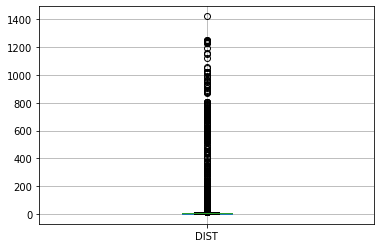
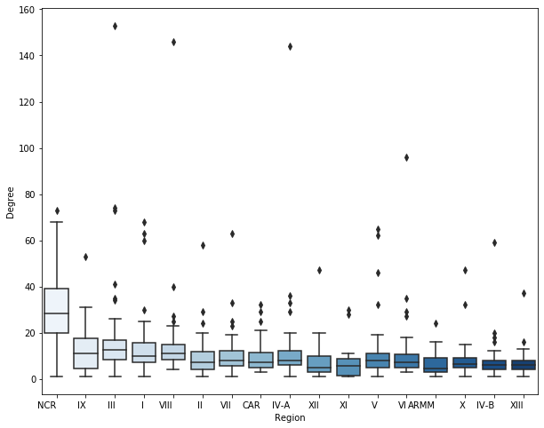
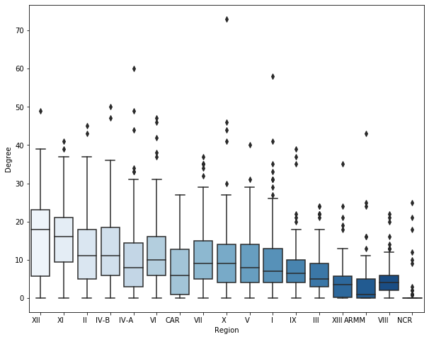
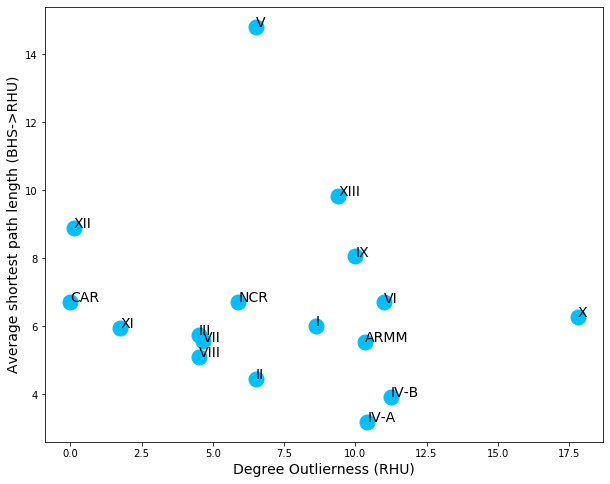
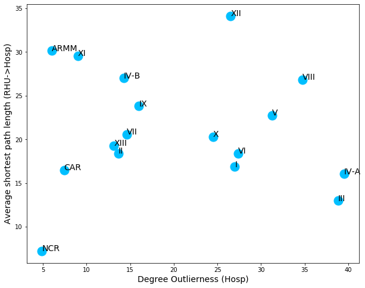
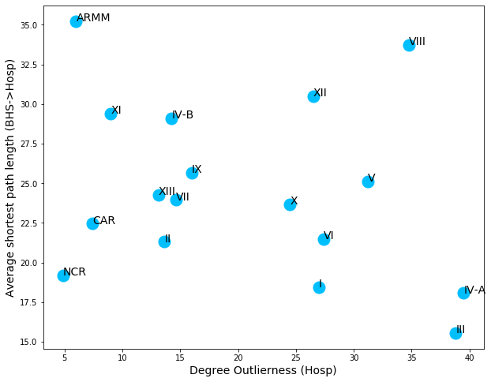
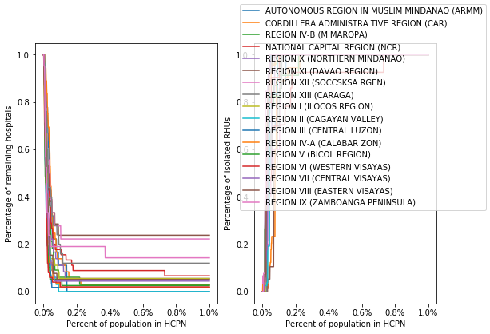

# Network Analysis of the Primary Healthcare Facility Referral System in the Philippines
##### By: Elijah Justin Medina and Jomilynn Rebanal

This project aims to analyze to referral system among health units in the Philippines in order to identify the characteristics and consequently, the robustness of this system. The main data used in this analysis are geospatial coordinates of different health units in the network &mdash; barangay health stations (BHS), rural health units (RHU), and hospitals. The network is supplemented with bed capacity information of the different health units. The aforementioned data was obtained from the DOH Data Collect app v2.1 and the National Health Facility Registry.

##### Preliminaries


```python
import pandas as pd
import numpy as np
from glob import glob
import sys
import locale
from geopy.distance import vincenty
import warnings

warnings.filterwarnings("ignore")
np.set_printoptions(threshold=sys.maxsize, precision=2)
pd.set_option('float_format', '{:,.2f}'.format)
pd.set_option('display.max_rows', 1000)
```

## Data Processing and Exploratory Data Analysis
Before performing the analysis, the data must be cleaned to standardize text and minimize effect of errors (e.g. typographical, encoding, outliers). The goal of this processing is to prepare the data for network analysis.

### Merging of multiple, separated files

##### Geographic Coordinates (Health Facility names and coordinates)


```python
files = glob('Geographic Coordinates/*.xlsx')
cols = ['Health Facility Code Short', 'Facility Name', 'Health Facility Type',
        'Region Name                                             ',
        'Province Name ', 'City/Municipality Name', 'Barangay Name',
        'Latitude', 'Longitude', 'Service Capability', 'Licensing Status',
        'Bed Capacity']

HF_list = pd.DataFrame()

for f in files:
    data = pd.read_excel(f, usecols=cols)
    HF_list = HF_list.append(data)
```


```python
HF_list.isnull().sum() # Verify mismatched fields across different excel files
```


```python
HF_list.columns = ['SHORT_HFCODE', 'HF_NAME', 'HF_TYPE', 'REGION', 'PROVINCE',
                  'MUNI_CITY', 'BRGY', 'LAT', 'LONG', 'SERVICE_CAP',
                  'LICENSING', 'BED_CAP']

str_cols = ['HF_NAME', 'HF_TYPE', 'REGION', 'PROVINCE', 'MUNI_CITY', 'BRGY',
            'SERVICE_CAP', 'LICENSING', 'BED_CAP']

HF_list[str_cols] = HF_list[str_cols].fillna('UNKNOWN').apply(lambda x: x.str.upper().str.strip())
HF_list['SHORT_HFCODE'] = HF_list['SHORT_HFCODE'].astype(int)

HF_list.to_excel('cleaned/HFList_cleaned.xlsx') #Store the combined dataframe
```

##### Rural Health Unit


```python
rhu = pd.read_excel('rhu2018.xlsx', sheet_name='MAIN', na_values='None')
```


```python
str_cols = ['HF_NAME', 'REGION', 'PROVINCE', 'MUNI_CITY', 'BRGY',
            'STREET_NAME', 'BUILDING', 'FACILITY_HEAD', 'DETACHED', 'BRGYS',
            'SDN', 'SDN_NAME', 'REF1_NAME', 'REF1_SAMEPROV',
            'REF1_REF1A', 'REF1A_SAMEPROV', 'REF2_NAME', 'REF3_NAME',  
            'AMB_ACCESS', 'AMB_OWN', 'PHIC_ACC', 'PHIC_PACKAGES', 'PHIC_MCP',
            'PHIC_PCB1', 'PHIC_MALARIA', 'PHIC_TBDOTS', 'PHIC_ABTC',
            'PHIC_NCP', 'PHIC_OTH']
code_cols = ['id', 'REF1_CODE', 'REF2_CODE', 'REF3_CODE']
float_cols = ['REF1_DIST', 'REF1_TRAVEL', 'REF2_DIST', 'REF2_TRAVEL',
             'REF3_DIST', 'REF3_TRAVEL']
# int_cols = ['id', 'BHS_COUNT','CATCHMENT', 'REF1_CODE', 'REF2_CODE',
#             'REF3_CODE',  'MD_NO', 'MD_AUG', 'MD_TOTAL','MD_FT', 'MD_PT',
#             'MD_VISIT', 'RN_NO', 'RN_AUG', 'RN_TOTAL', 'RN_FT', 'RN_PT',
#             'RN_VISIT', 'MW_NO', 'MW_AUG', 'MW_TOTAL', 'MW_FT', 'MW_PT',
#             'MW_VISIT']

rhu[str_cols] = rhu[str_cols].apply(lambda x: x.str.upper().str.strip())
rhu[code_cols] = rhu[code_cols].fillna(0).astype(int)
rhu[float_cols] = rhu[float_cols].astype(float)

rhu[str_cols] = rhu[str_cols].fillna('UNKNOWN')

# Extract short code for merging with the Geographic Coordinates files
rhu['SHORT_HFCODE'] = rhu['HF_CODE'].apply(lambda x: int(x[-6:]))

rhu.to_excel('cleaned/rhu_cleaned.xlsx')
```

### Impute missing information from other tables
As the data is being processed from different tables, the other tables can be used to fill some missing information. Aside from imputing missing information, coordinates outside the Philippines are identified.


```python
# Bounding box for the Philippines (manually extracted from Google).
long_min, lat_min, long_max, lat_max = (117.17427453, 5.58100332277, 126.537423944, 18.5052273625)
```


```python
HF_list = pd.read_excel('cleaned/HFList_cleaned.xlsx')

# Groupby the data to account for duplicate names for different codes
HF_dict = HF_list[['HF_NAME', 'SHORT_HFCODE']].groupby('HF_NAME')['SHORT_HFCODE'].apply(set).to_dict()
latlong_dict = HF_list[['SHORT_HFCODE', 'LAT', 'LONG']].set_index('SHORT_HFCODE').to_dict()

```

#### RHU


```python
rhu = pd.read_excel('cleaned/rhu_cleaned.xlsx')

# Create copies of the dataframe for later use
rhu2 = rhu.copy()
rhu3 = rhu.copy()
```

##### Fill missing REF1 Codes


```python
cols = ['id', 'HF_CODE', 'SHORT_HFCODE', 'HF_NAME', 'REGION', 'PROVINCE', 'MUNI_CITY', 'BRGY',
            'STREET_NAME', 'BUILDING', 'FACILITY_HEAD', 'DETACHED', 'BRGYS',
            'SDN', 'SDN_NAME', 'REF1_NAME', 'REF1_SAMEPROV',
            'REF1_REF1A', 'REF1A_SAMEPROV', 'REF2_NAME', 'REF3_NAME',  
            'AMB_ACCESS', 'AMB_OWN', 'PHIC_ACC', 'PHIC_PACKAGES', 'PHIC_MCP',
            'PHIC_PCB1', 'PHIC_MALARIA', 'PHIC_TBDOTS', 'PHIC_ABTC',
            'PHIC_NCP', 'PHIC_OTH', 'REF1_CODE', 'REF1_DIST', 'REF1_TRAVEL',
            'REF2_CODE', 'REF2_DIST', 'REF2_TRAVEL',
            'REF3_CODE', 'REF3_DIST', 'REF3_TRAVEL']

rhu = rhu[cols]

# Using the health facility list, complete the RHU data
rhu.loc[rhu['REF1_CODE']==0, 'REF_CODE'] = rhu[rhu['REF1_CODE']==0]['REF1_NAME'].map(HF_dict)
```


```python
temp = rhu[['SHORT_HFCODE', 'REF_CODE']].dropna().copy()

# This dataframe contains the HF codes of one health facility to other facilities.
temp.head()
```


<div>
<style scoped>
    .dataframe tbody tr th:only-of-type {
        vertical-align: middle;
    }

    .dataframe tbody tr th {
        vertical-align: top;
    }

    .dataframe thead th {
        text-align: right;
    }
</style>
<table border="1" class="dataframe">
  <thead>
    <tr style="text-align: right;">
      <th></th>
      <th>SHORT_HFCODE</th>
      <th>REF_CODE</th>
    </tr>
  </thead>
  <tbody>
    <tr>
      <th>8</th>
      <td>2228</td>
      <td>{3313}</td>
    </tr>
    <tr>
      <th>20</th>
      <td>6698</td>
      <td>{3313}</td>
    </tr>
    <tr>
      <th>29</th>
      <td>147</td>
      <td>{2703}</td>
    </tr>
    <tr>
      <th>36</th>
      <td>2033</td>
      <td>{3667}</td>
    </tr>
    <tr>
      <th>37</th>
      <td>2184</td>
      <td>{2703}</td>
    </tr>
  </tbody>
</table>
</div>


```python
# Out of all the mapped referred facilities, the closest facility is used as the actual referred facility
# Slight pre-processing: "place" the health facilities without coordinates to southwest of southwest Philippine boundary (lat_min - 10, long_min - 20) or northeast of northeast Philippine boundary
temp_dict = pd.DataFrame(temp.apply(lambda x: min([(vincenty((latlong_dict['LAT'][x['SHORT_HFCODE']] if latlong_dict['LAT'][x['SHORT_HFCODE']]==latlong_dict['LAT'][x['SHORT_HFCODE']] else lat_min-10,
                                                  latlong_dict['LONG'][x['SHORT_HFCODE']] if latlong_dict['LONG'][x['SHORT_HFCODE']]==latlong_dict['LONG'][x['SHORT_HFCODE']] else long_min-20),
                                                 (latlong_dict['LAT'][i] if latlong_dict['LAT'][i]==latlong_dict['LAT'][i] else lat_max+10,
                                                  latlong_dict['LONG'][i] if latlong_dict['LONG'][i]==latlong_dict['LONG'][i] else long_max+20)).km, i, x['SHORT_HFCODE']) for i in x['REF_CODE']], key=lambda x: x[0]), axis=1).tolist()).set_index(2).to_dict()

rhu['REF_CODE'] = rhu['SHORT_HFCODE'].map(temp_dict[1])
rhu.loc[rhu['REF1_CODE']!=0, 'REF_CODE'] = rhu.loc[rhu['REF1_CODE']!=0, 'REF1_CODE']
```

##### Fill missing REF2 Codes

The data contains up to three referred facilities so the same processing is performed for the second and third HF code.


```python
rhu2.loc[rhu2['REF2_CODE']==0, 'REF_CODE'] = rhu2[rhu2['REF2_CODE']==0]['REF2_NAME'].map(HF_dict)

temp = rhu2[['SHORT_HFCODE', 'REF_CODE']].dropna().copy()
temp_dict = pd.DataFrame(temp.apply(lambda x: min([(vincenty((latlong_dict['LAT'][x['SHORT_HFCODE']] if latlong_dict['LAT'][x['SHORT_HFCODE']]==latlong_dict['LAT'][x['SHORT_HFCODE']] else lat_min-10,
                                                  latlong_dict['LONG'][x['SHORT_HFCODE']] if latlong_dict['LONG'][x['SHORT_HFCODE']]==latlong_dict['LONG'][x['SHORT_HFCODE']] else long_min-20),
                                                 (latlong_dict['LAT'][i] if latlong_dict['LAT'][i]==latlong_dict['LAT'][i] else lat_max+10,
                                                  latlong_dict['LONG'][i] if latlong_dict['LONG'][i]==latlong_dict['LONG'][i] else long_max+20)).km, i, x['SHORT_HFCODE']) for i in x['REF_CODE']], key=lambda x: x[0]), axis=1).tolist()).set_index(2).to_dict()

rhu2['REF_CODE'] = rhu2['SHORT_HFCODE'].map(temp_dict[1])
rhu2.loc[rhu2['REF2_CODE']!=0, 'REF_CODE'] = rhu2.loc[rhu2['REF2_CODE']!=0, 'REF2_CODE']
```

##### Fill missing REF3 Codes


```python
rhu3.loc[rhu3['REF3_CODE']==0, 'REF_CODE'] = rhu3[rhu3['REF3_CODE']==0]['REF3_NAME'].map(HF_dict)

temp = rhu3[['SHORT_HFCODE', 'REF_CODE']].dropna().copy()
temp_dict = pd.DataFrame(temp.apply(lambda x: min([(vincenty((latlong_dict['LAT'][x['SHORT_HFCODE']] if latlong_dict['LAT'][x['SHORT_HFCODE']]==latlong_dict['LAT'][x['SHORT_HFCODE']] else lat_min-10,
                                                  latlong_dict['LONG'][x['SHORT_HFCODE']] if latlong_dict['LONG'][x['SHORT_HFCODE']]==latlong_dict['LONG'][x['SHORT_HFCODE']] else long_min-20),
                                                 (latlong_dict['LAT'][i] if latlong_dict['LAT'][i]==latlong_dict['LAT'][i] else lat_max+10,
                                                  latlong_dict['LONG'][i] if latlong_dict['LONG'][i]==latlong_dict['LONG'][i] else long_max+20)).km, i, x['SHORT_HFCODE']) for i in x['REF_CODE']], key=lambda x: x[0]), axis=1).tolist()).set_index(2).to_dict()

rhu3['REF_CODE'] = rhu3['SHORT_HFCODE'].map(temp_dict[1])
rhu3.loc[rhu3['REF3_CODE']!=0, 'REF_CODE'] = rhu3.loc[rhu3['REF3_CODE']!=0, 'REF3_CODE']
```


```python
rhu.dropna(subset=['REF_CODE'], inplace=True)
rhu2.dropna(subset=['REF_CODE'], inplace=True)
rhu3.dropna(subset=['REF_CODE'], inplace=True)
```

##### Combine the processed dataframes


```python
rhu.rename({'REF1_DIST':'REF_DIST', 'REF1_TRAVEL':'REF_TRAVEL', 'REF1_NAME':'REF_NAME'}, axis=1, inplace=True)
rhu2.rename({'REF2_DIST':'REF_DIST', 'REF2_TRAVEL':'REF_TRAVEL', 'REF1_NAME':'REF_NAME'}, axis=1, inplace=True)
rhu3.rename({'REF3_DIST':'REF_DIST', 'REF3_TRAVEL':'REF_TRAVEL', 'REF1_NAME':'REF_NAME'}, axis=1, inplace=True)
```


```python
cols2 = ['SHORT_HFCODE', 'REF_CODE']
rhu_edges = rhu[cols2].append(rhu2[cols2]).append(rhu3[cols2])
```


```python
# Add a column identifying the type of facility for the later network analysis

rhu_edges['HF_TYPE'] = 'RHU'
```


```python
HF_list[['SHORT_HFCODE', 'LAT', 'LONG']].describe()
```


<div>
<style scoped>
    .dataframe tbody tr th:only-of-type {
        vertical-align: middle;
    }

    .dataframe tbody tr th {
        vertical-align: top;
    }

    .dataframe thead th {
        text-align: right;
    }
</style>
<table border="1" class="dataframe">
  <thead>
    <tr style="text-align: right;">
      <th></th>
      <th>SHORT_HFCODE</th>
      <th>LAT</th>
      <th>LONG</th>
    </tr>
  </thead>
  <tbody>
    <tr>
      <th>count</th>
      <td>29,424.00</td>
      <td>25,752.00</td>
      <td>25,752.00</td>
    </tr>
    <tr>
      <th>mean</th>
      <td>19,505.19</td>
      <td>12.27</td>
      <td>122.49</td>
    </tr>
    <tr>
      <th>std</th>
      <td>11,203.47</td>
      <td>7.11</td>
      <td>4.42</td>
    </tr>
    <tr>
      <th>min</th>
      <td>1.00</td>
      <td>0.00</td>
      <td>0.00</td>
    </tr>
    <tr>
      <th>25%</th>
      <td>9,724.75</td>
      <td>9.52</td>
      <td>121.02</td>
    </tr>
    <tr>
      <th>50%</th>
      <td>19,799.50</td>
      <td>12.73</td>
      <td>122.38</td>
    </tr>
    <tr>
      <th>75%</th>
      <td>29,542.25</td>
      <td>14.81</td>
      <td>124.16</td>
    </tr>
    <tr>
      <th>max</th>
      <td>38,002.00</td>
      <td>1,000.00</td>
      <td>126.58</td>
    </tr>
  </tbody>
</table>
</div>


##### Map lat-long to the HF codes


```python
rhu_edges['source_lat'] = rhu_edges['SHORT_HFCODE'].map(latlong_dict['LAT'])
rhu_edges['source_long'] = rhu_edges['SHORT_HFCODE'].map(latlong_dict['LONG'])
rhu_edges['target_lat'] = rhu_edges['REF_CODE'].map(latlong_dict['LAT'])
rhu_edges['target_long'] = rhu_edges['REF_CODE'].map(latlong_dict['LONG'])
```

##### Set lat-long outside PH to NaN


```python
rhu_edges.loc[~((rhu_edges['source_lat'].between(lat_min, lat_max)) & (rhu_edges['source_long'].between(
    long_min, long_max))), ['source_lat', 'source_long']] = np.nan
rhu_edges.loc[~((rhu_edges['target_lat'].between(lat_min, lat_max)) & (rhu_edges['target_long'].between(
    long_min, long_max))), ['target_lat', 'target_long']] = np.nan
```

##### Measure distance using lat-long for non-NaN HF pairs


```python
missing_latlong = ~rhu_edges[['source_lat', 'source_long', 'target_lat', 'target_long']].isnull().sum(axis=1).astype(bool)
rhu_edges.loc[missing_latlong, 'DIST'] = rhu_edges.loc[missing_latlong, ['source_lat', 'source_long', 'target_lat', 'target_long']].apply(lambda x: vincenty((x['source_lat'], x['source_long']), (x['target_lat'], x['target_long'])).km, axis=1)

rhu_edges.loc[rhu_edges['DIST']==0, 'DIST'] = 1
```

##### Check for outliers
In this case, referral between facilities that are too high are classified as outliers. The threshold to be used for filtering out these outliers is subject to the researcher's choice. The unit of distance is in kilometers. Note that since the distance is extracted from coordinates, errors in encoding will change the actual coordinates of the facilities, therefore making changes to the distance (e.g. dividing by a constant factor) cannot be done. Instead, other imputing techinques are used to fill for missing distance data.


```python
B = rhu_edges.boxplot('DIST', return_type='both')
```


```python
outliers = [i.get_ydata()[1] for i in B.lines['whiskers']]
rhu_edges.loc[rhu_edges['DIST'] > outliers[1], 'DIST'] = np.nan
```


```python
outliers
```


    [0.0006040641840882818, 88.56724901828711]


```python
muni_dict = HF_list[['SHORT_HFCODE', 'MUNI_CITY', 'PROVINCE']].set_index('SHORT_HFCODE').to_dict()
```

##### Impute distance from municipality
With the municipality information of the facilities, the distance of different health units are imputed using the median. The assumption is that within the same municipality, the distance of referring facilities are more or less similar. For tracking, the source of the distance information is stored.


```python
rhu_edges['muni_city'] = rhu_edges['SHORT_HFCODE'].map(muni_dict['MUNI_CITY'])
mean_dist_city = rhu_edges.groupby('muni_city')['DIST'].median().to_dict()

imputed_muni = ~(rhu_edges.loc[rhu_edges['DIST'].isnull(), 'muni_city'].map(mean_dist_city).isnull())
imputed_muni = imputed_muni[imputed_muni].index
rhu_edges.loc[imputed_muni, "IMPUTED"] = "MUNI"
rhu_edges.loc[rhu_edges['DIST'].isnull(), 'DIST'] = rhu_edges.loc[rhu_edges['DIST'].isnull(), 'muni_city'].map(mean_dist_city)
```

##### Impute distance from province
For those facilities without municipality information, the province is used.


```python
rhu_edges['province'] = rhu_edges['SHORT_HFCODE'].map(muni_dict['PROVINCE'])
mean_dist_prov = rhu_edges.groupby('province')['DIST'].median().to_dict()

imputed_prov = ~(rhu_edges.loc[rhu_edges['DIST'].isnull(), 'province'].map(mean_dist_prov).isnull())
imputed_prov = imputed_prov[imputed_prov].index

rhu_edges.loc[imputed_prov, "IMPUTED"] = "PROV"
rhu_edges.loc[rhu_edges['DIST'].isnull(), 'DIST'] = rhu_edges.loc[rhu_edges['DIST'].isnull(), 'province'].map(mean_dist_prov)
```


```python
rhu_edges['DIST'].isnull().sum()
```


    17


If after all these, the referring facilities still do not have distance information, the connection between the facilities is dropped.


```python
rhu_edges.dropna(subset=['DIST'], inplace=True)
```


```python
prov_HF_dict = rhu_edges.groupby('province')[['SHORT_HFCODE', 'REF_CODE']].agg(set).rename({'SHORT_HFCODE':'RHU', 'REF_CODE':'HOSP'}, axis=1).to_dict()
```


```python
rhu_edges['REF_CODES'] = [set(rhu_edges[~rhu_edges[['target_lat', 'target_long']].isnull().sum(axis=1).astype(bool)]['REF_CODE'])] * len(rhu_edges)
```


```python
rhu_edges = rhu_edges[rhu_edges['REF_CODE']!=rhu_edges['SHORT_HFCODE']]
```

##### Connect nearest neighbors
The referrals above are based on actual data, i.e. actual referrals from facility to facility. This list is supplemented with the three nearest facilities, regardless of being the same facilities as the actual data.


```python
n = 3 #num of nearest neighbors to connect
temp = rhu_edges[['SHORT_HFCODE', 'REF_CODES']].dropna().drop_duplicates(subset='SHORT_HFCODE').copy()
df_neighbors = pd.DataFrame(temp.apply(lambda x: sorted([(vincenty((latlong_dict['LAT'][x['SHORT_HFCODE']] if latlong_dict['LAT'][x['SHORT_HFCODE']]==latlong_dict['LAT'][x['SHORT_HFCODE']] else lat_min-10,
                                                  latlong_dict['LONG'][x['SHORT_HFCODE']] if latlong_dict['LONG'][x['SHORT_HFCODE']]==latlong_dict['LONG'][x['SHORT_HFCODE']] else long_min-20),
                                                 (latlong_dict['LAT'][i] if latlong_dict['LAT'][i]==latlong_dict['LAT'][i] else lat_max+10,
                                                  latlong_dict['LONG'][i] if latlong_dict['LONG'][i]==latlong_dict['LONG'][i] else long_max+20)).km, i, x['SHORT_HFCODE']) for i in x['REF_CODES'] if i!=x['SHORT_HFCODE']], key=lambda x: x[0])[:n], axis=1).tolist())#.set_index(2).to_dict()
```


```python
df_neighbors_edges = pd.DataFrame(df_neighbors[0].append(df_neighbors[1]).append(df_neighbors[2]).tolist(), columns=['DIST', 'REF_CODE', 'SHORT_HFCODE'])
```


```python
df_neighbors_edges['IMPUTED'] = 'NEAREST_NEIGHBOR'
```


```python
rhu_edges[['SHORT_HFCODE', 'REF_CODE', 'DIST', 'IMPUTED']]
```


<div>
<style scoped>
    .dataframe tbody tr th:only-of-type {
        vertical-align: middle;
    }

    .dataframe tbody tr th {
        vertical-align: top;
    }

    .dataframe thead th {
        text-align: right;
    }
</style>
<table border="1" class="dataframe">
  <thead>
    <tr style="text-align: right;">
      <th></th>
      <th>SHORT_HFCODE</th>
      <th>REF_CODE</th>
      <th>DIST</th>
      <th>IMPUTED</th>
    </tr>
  </thead>
  <tbody>
    <tr>
      <th>0</th>
      <td>25</td>
      <td>32,170.00</td>
      <td>0.00</td>
      <td>NaN</td>
    </tr>
    <tr>
      <th>1</th>
      <td>105</td>
      <td>5,940.00</td>
      <td>0.41</td>
      <td>NaN</td>
    </tr>
    <tr>
      <th>2</th>
      <td>106</td>
      <td>3,313.00</td>
      <td>11.13</td>
      <td>NaN</td>
    </tr>
    <tr>
      <th>4</th>
      <td>137</td>
      <td>3,313.00</td>
      <td>11.29</td>
      <td>NaN</td>
    </tr>
    <tr>
      <th>5</th>
      <td>1760</td>
      <td>6,513.00</td>
      <td>5.98</td>
      <td>NaN</td>
    </tr>
    <tr>
      <th>...</th>
      <td>...</td>
      <td>...</td>
      <td>...</td>
      <td>...</td>
    </tr>
    <tr>
      <th>2296</th>
      <td>6814</td>
      <td>273.00</td>
      <td>51.12</td>
      <td>NaN</td>
    </tr>
    <tr>
      <th>2297</th>
      <td>7045</td>
      <td>273.00</td>
      <td>15.07</td>
      <td>NaN</td>
    </tr>
    <tr>
      <th>2298</th>
      <td>7696</td>
      <td>273.00</td>
      <td>29.09</td>
      <td>NaN</td>
    </tr>
    <tr>
      <th>2299</th>
      <td>8861</td>
      <td>273.00</td>
      <td>16.35</td>
      <td>NaN</td>
    </tr>
    <tr>
      <th>2300</th>
      <td>27898</td>
      <td>237.00</td>
      <td>41.68</td>
      <td>MUNI</td>
    </tr>
  </tbody>
</table>
<p>5925 rows × 4 columns</p>
</div>


```python
rhu_edges = rhu_edges[['SHORT_HFCODE', 'REF_CODE', 'DIST', 'IMPUTED']].append(df_neighbors_edges)
```


```python
rhu_edges.loc[rhu_edges['DIST'] > outliers[1], 'DIST'] = np.nan
rhu_edges.loc[rhu_edges['DIST']==0, 'DIST'] = 1
```


```python
rhu_edges.describe()
```


<div>
<style scoped>
    .dataframe tbody tr th:only-of-type {
        vertical-align: middle;
    }

    .dataframe tbody tr th {
        vertical-align: top;
    }

    .dataframe thead th {
        text-align: right;
    }
</style>
<table border="1" class="dataframe">
  <thead>
    <tr style="text-align: right;">
      <th></th>
      <th>DIST</th>
      <th>REF_CODE</th>
      <th>SHORT_HFCODE</th>
    </tr>
  </thead>
  <tbody>
    <tr>
      <th>count</th>
      <td>12,157.00</td>
      <td>12,330.00</td>
      <td>12,330.00</td>
    </tr>
    <tr>
      <th>mean</th>
      <td>16.11</td>
      <td>4,600.62</td>
      <td>5,816.23</td>
    </tr>
    <tr>
      <th>std</th>
      <td>16.55</td>
      <td>7,159.54</td>
      <td>6,469.21</td>
    </tr>
    <tr>
      <th>min</th>
      <td>0.00</td>
      <td>1.00</td>
      <td>10.00</td>
    </tr>
    <tr>
      <th>25%</th>
      <td>3.39</td>
      <td>622.00</td>
      <td>2,307.00</td>
    </tr>
    <tr>
      <th>50%</th>
      <td>11.07</td>
      <td>2,850.00</td>
      <td>4,234.00</td>
    </tr>
    <tr>
      <th>75%</th>
      <td>22.87</td>
      <td>5,139.00</td>
      <td>7,062.00</td>
    </tr>
    <tr>
      <th>max</th>
      <td>88.57</td>
      <td>261,101.00</td>
      <td>36,628.00</td>
    </tr>
  </tbody>
</table>
</div>


#### BHS
The same processing done for the rural health units is performed for the barangay health stations.


```python
bhs = pd.read_excel('bhs2018.xlsx', sheet_name='MAIN', na_values='None')
```


```python
str_cols = ['HF_NAME', 'REGION', 'PROVINCE', 'MUNI_CITY', 'BRGY',
            'STREET_NAME', 'BUILDING', 'FACILITY_HEAD', 'DETACHED',
            'BRGYS', 'RHU_NAME', 'RHU_SAME_CTY', 'RHU_NOTSAME_CTY',
            'AMB_ACCESS']
code_cols = ['id', 'RHU_CODE']
float_cols = ['RHU_DIST', 'RHU_TRAVEL']
# int_cols = ['CATCHMENT', 'MD_NO', 'MD_AUG', 'MD_TOTAL',
#        'MD_FT', 'MD_PT', 'MD_VISIT', 'RN_NO', 'RN_AUG', 'RN_TOTAL', 'RN_FT',
#        'RN_PT', 'RN_VISIT', 'MW_NO', 'MW_AUG', 'MW_TOTAL', 'MW_FT', 'MW_PT',
#        'MW_VISIT', 'BHW_NO']

bhs[str_cols] = bhs[str_cols].apply(lambda x: x.str.upper().str.strip())
bhs[code_cols] = bhs[code_cols].fillna(0).astype(int)
bhs[float_cols] = bhs[float_cols].astype(float)

bhs[str_col] = bhs[str_col].fillna('UNKNOWN')
bhs['SHORT_HFCODE'] = bhs['HF_CODE'].apply(lambda x: int(x[-6:]))
bhs.to_excel('cleaned/bhs_cleaned.xlsx')
```

##### Fill missing RHU Codes


```python
bhs = pd.read_excel('cleaned/bhs_cleaned.xlsx')
```


```python
bhs.loc[bhs['RHU_CODE']==0, 'REF_CODE'] = bhs[bhs['RHU_CODE']==0]['RHU_NAME'].map(HF_dict)
```


```python
temp = bhs[['SHORT_HFCODE', 'REF_CODE']].dropna().copy()
temp_dict = pd.DataFrame(temp.apply(lambda x: min([(vincenty((latlong_dict['LAT'][x['SHORT_HFCODE']] if latlong_dict['LAT'][x['SHORT_HFCODE']]==latlong_dict['LAT'][x['SHORT_HFCODE']] else lat_min-10,
                                                  latlong_dict['LONG'][x['SHORT_HFCODE']] if latlong_dict['LONG'][x['SHORT_HFCODE']]==latlong_dict['LONG'][x['SHORT_HFCODE']] else long_min-20),
                                                 (latlong_dict['LAT'][i] if latlong_dict['LAT'][i]==latlong_dict['LAT'][i] else lat_max+10,
                                                  latlong_dict['LONG'][i] if latlong_dict['LONG'][i]==latlong_dict['LONG'][i] else long_max+20)).km, i, x['SHORT_HFCODE']) for i in x['REF_CODE']], key=lambda x: x[0]), axis=1).tolist()).set_index(2).to_dict()
```


```python
bhs['DIST'].isnull().sum()
```


    17


```python
bhs.dropna(subset=['REF_CODE'], inplace=True)
```


```python
cols = ['SHORT_HFCODE', 'REF_CODE']
```


```python
bhs = bhs[cols]
bhs['HF_TYPE'] = 'BHS'
```


```python
bhs['source_lat'] = bhs['SHORT_HFCODE'].map(latlong_dict['LAT'])
bhs['source_long'] = bhs['SHORT_HFCODE'].map(latlong_dict['LONG'])
bhs['target_lat'] = bhs['REF_CODE'].map(latlong_dict['LAT'])
bhs['target_long'] = bhs['REF_CODE'].map(latlong_dict['LONG'])
```


```python
bhs.loc[~((bhs['source_lat'].between(lat_min, lat_max)) & (bhs['source_long'].between(
    long_min, long_max))), ['source_lat', 'source_long']] = np.nan
bhs.loc[~((bhs['target_lat'].between(lat_min, lat_max)) & (bhs['target_long'].between(
    long_min, long_max))), ['target_lat', 'target_long']] = np.nan
```


```python
missing_latlong = ~bhs[['source_lat', 'source_long', 'target_lat', 'target_long']].isnull().sum(axis=1).astype(bool)
bhs.loc[missing_latlong, 'DIST'] = bhs.loc[missing_latlong, ['source_lat', 'source_long', 'target_lat', 'target_long']].apply(lambda x: vincenty((x['source_lat'], x['source_long']), (x['target_lat'], x['target_long'])).km, axis=1)
```


```python
bhs.loc[bhs['DIST']==0, 'DIST'] = 1
```


```python
B = bhs.boxplot('DIST', return_type='both')
```





```python
outliers = [i.get_ydata()[1] for i in B.lines['whiskers']]
```


```python
outliers
```


    [0.00011063857573315692, 15.946669430143814]


```python
outliers = [i.get_ydata()[1] for i in B.lines['whiskers']]
bhs.loc[bhs['DIST'] > outliers[1], 'DIST'] = np.nan
```


```python
muni_dict = HF_list[['SHORT_HFCODE', 'MUNI_CITY', 'PROVINCE']].set_index('SHORT_HFCODE').to_dict()
```


```python
bhs['muni_city'] = bhs['SHORT_HFCODE'].map(muni_dict['MUNI_CITY'])
mean_dist_city = bhs.groupby('muni_city')['DIST'].mean().to_dict()

imputed_muni = ~(bhs.loc[bhs['DIST'].isnull(), 'muni_city'].map(mean_dist_city).isnull())
imputed_muni = imputed_muni[imputed_muni].index
bhs.loc[imputed_muni, "IMPUTED"] = "MUNI"
bhs.loc[bhs['DIST'].isnull(), 'DIST'] = bhs.loc[bhs['DIST'].isnull(), 'muni_city'].map(mean_dist_city)
```


```python
bhs['province'] = bhs['SHORT_HFCODE'].map(muni_dict['PROVINCE'])
mean_dist_prov = bhs.groupby('province')['DIST'].mean().to_dict()

imputed_prov = ~(bhs.loc[bhs['DIST'].isnull(), 'province'].map(mean_dist_prov).isnull())
imputed_prov = imputed_prov[imputed_prov].index

bhs.loc[imputed_prov, "IMPUTED"] = "PROV"
bhs.loc[bhs['DIST'].isnull(), 'DIST'] = bhs.loc[bhs['DIST'].isnull(), 'province'].map(mean_dist_prov)
```


```python
bhs['DIST'].isnull().sum()
```


    55


```python
bhs.dropna(subset=['DIST'], inplace=True)
```


```python
bhs = bhs[['SHORT_HFCODE', 'REF_CODE', 'DIST', 'IMPUTED']]
```


```python
bhs = bhs[bhs['REF_CODE'] != bhs['SHORT_HFCODE']]
```


```python
edge_list = rhu_edges.append(bhs)
edge_list
```


<div>
<style scoped>
    .dataframe tbody tr th:only-of-type {
        vertical-align: middle;
    }

    .dataframe tbody tr th {
        vertical-align: top;
    }

    .dataframe thead th {
        text-align: right;
    }
</style>
<table border="1" class="dataframe">
  <thead>
    <tr style="text-align: right;">
      <th></th>
      <th>DIST</th>
      <th>IMPUTED</th>
      <th>REF_CODE</th>
      <th>SHORT_HFCODE</th>
    </tr>
  </thead>
  <tbody>
    <tr>
      <th>0</th>
      <td>0.00</td>
      <td>NaN</td>
      <td>32,170.00</td>
      <td>25</td>
    </tr>
    <tr>
      <th>1</th>
      <td>0.41</td>
      <td>NaN</td>
      <td>5,940.00</td>
      <td>105</td>
    </tr>
    <tr>
      <th>2</th>
      <td>11.13</td>
      <td>NaN</td>
      <td>3,313.00</td>
      <td>106</td>
    </tr>
    <tr>
      <th>4</th>
      <td>11.29</td>
      <td>NaN</td>
      <td>3,313.00</td>
      <td>137</td>
    </tr>
    <tr>
      <th>5</th>
      <td>5.98</td>
      <td>NaN</td>
      <td>6,513.00</td>
      <td>1760</td>
    </tr>
    <tr>
      <th>...</th>
      <td>...</td>
      <td>...</td>
      <td>...</td>
      <td>...</td>
    </tr>
    <tr>
      <th>19775</th>
      <td>3.89</td>
      <td>PROV</td>
      <td>5,828.00</td>
      <td>36080</td>
    </tr>
    <tr>
      <th>19776</th>
      <td>3.89</td>
      <td>PROV</td>
      <td>3,257.00</td>
      <td>31557</td>
    </tr>
    <tr>
      <th>19780</th>
      <td>3.89</td>
      <td>PROV</td>
      <td>261.00</td>
      <td>31561</td>
    </tr>
    <tr>
      <th>19781</th>
      <td>3.89</td>
      <td>PROV</td>
      <td>2,610.00</td>
      <td>36436</td>
    </tr>
    <tr>
      <th>19782</th>
      <td>3.89</td>
      <td>PROV</td>
      <td>2,610.00</td>
      <td>36437</td>
    </tr>
  </tbody>
</table>
<p>30094 rows × 4 columns</p>
</div>


```python
edge_list = edge_list.groupby(['REF_CODE', 'SHORT_HFCODE'])[['IMPUTED', 'DIST']].agg({'DIST':'mean', 'IMPUTED':'first'}).reset_index()
```


```python
edge_list.to_excel('edge_list.xlsx', index=False)
```

## Network Analysis

Using the facilities as nodes and the referral as edges, a tripartite network of BHS, RHU, and hospitals is created. The characteristics of the healthcare provider network for different regions are characterized and explored in this section. The main metric used in the analysis is degree and path length.


```python
import pandas as pd
import networkx as nx
%matplotlib inline
import matplotlib.pyplot as plt
import numpy as np
import itertools
import random
```


```python
nodes = pd.read_excel("nodeslist.xlsx")
edges = pd.read_excel("edge_list.xlsx")
```

For the succeeding analysis, the imputed distances using the nearest neighbors are not included.


```python
edges = edges[(edges['IMPUTED']!='NEAREST_NEIGHBOR') | (edges['SHORT_HFCODE']!=6108)]
```


```python
nodes.drop(['LAT', 'LONG'], axis=1, inplace=True)
```


```python
G = nx.from_pandas_edgelist(edges, source='SHORT_HFCODE', target='REF_CODE', edge_attr='DIST', create_using=nx.DiGraph)
```


```python
nodes.index = nodes['SHORT_HFCODE']
```


```python
node_attrib = nodes.to_dict()
```


```python
for col in nodes.columns:
    nx.set_node_attributes(G, node_attrib[col], col)
```


```python
bhs_nodes = [i for i, j in G.nodes(data=True) if j.get('HF_TYPE')=='BARANGAY HEALTH STATION']
rhu_nodes = [i for i, j in G.nodes(data=True) if j.get('HF_TYPE')=='RURAL HEALTH UNIT']
hosp_nodes = [i for i, j in G.nodes(data=True) if ((j.get('HF_TYPE')=='HOSPITAL') or (j.get('HF_TYPE')=='INFIRMARY'))]
```

### Degree (Hospital)


```python
import seaborn as sns
```


```python
region_deg = {}
for region in nodes['REGION'].unique():
    deg = list(dict(G.in_degree(nodes[((nodes['HF_TYPE']=='INFIRMARY') | (nodes['HF_TYPE']=='HOSPITAL')) & (nodes['REGION']==region)]['SHORT_HFCODE'])).values())
    region_deg[region] = deg
```


```python
df_deg = pd.DataFrame(list(itertools.chain(*[list(zip(len(j) * [i], j)) for i, j in region_deg.items()]))).rename({0:'Region', 1:'Degree'}, axis=1)#.boxplot(by=0)
```


```python
region_map = {'AUTONOMOUS REGION IN MUSLIM MINDANAO (ARMM)':'ARMM',
       'CORDILLERA ADMINISTRA TIVE REGION (CAR)':'CAR',
       'REGION IV-B (MIMAROPA)':'IV-B', 'NATIONAL CAPITAL REGION (NCR)':'NCR',
       'REGION X (NORTHERN MINDANAO)':'X', 'REGION XI (DAVAO REGION)':'XI',
       'REGION XII (SOCCSKSA RGEN)':'XII', 'REGION XIII (CARAGA)':'XIII',
       'REGION I (ILOCOS REGION)':'I', 'REGION II (CAGAYAN VALLEY)':'II',
       'REGION III (CENTRAL LUZON)':'III', 'REGION IV-A (CALABAR ZON)':'IV-A',
       'REGION V (BICOL REGION)':'V', 'REGION VI (WESTERN VISAYAS)':'VI',
       'REGION VII (CENTRAL VISAYAS)':'VII', 'REGION VIII (EASTERN VISAYAS)':'VIII',
       'REGION IX (ZAMBOANGA PENINSULA)':'IX'}
```


```python
df_deg['Region'] = df_deg['Region'].map(region_map)
```


```python
(df_deg.groupby('Region')['Degree']
 .agg(['min', 'max', 'mean', 'median', 'count']).sort_values(by='Region')
 [['max', 'mean', 'median', 'count']]
.style
#  .highlight_max(subset='mean', color='lightskyblue')
# .highlight_min(subset=['mean', 'median', 'count'], axis=0, color='lightskyblue')
.background_gradient(cmap='Blues'))
```


<style  type="text/css" >
    #T_e2f54cae_6dd2_11ea_8ccc_9828a631b9e6row0_col0 {
            background-color:  #f7fbff;
            color:  #000000;
        }    #T_e2f54cae_6dd2_11ea_8ccc_9828a631b9e6row0_col1 {
            background-color:  #f6faff;
            color:  #000000;
        }    #T_e2f54cae_6dd2_11ea_8ccc_9828a631b9e6row0_col2 {
            background-color:  #f7fbff;
            color:  #000000;
        }    #T_e2f54cae_6dd2_11ea_8ccc_9828a631b9e6row0_col3 {
            background-color:  #f7fbff;
            color:  #000000;
        }    #T_e2f54cae_6dd2_11ea_8ccc_9828a631b9e6row1_col0 {
            background-color:  #ebf3fb;
            color:  #000000;
        }    #T_e2f54cae_6dd2_11ea_8ccc_9828a631b9e6row1_col1 {
            background-color:  #e0ecf8;
            color:  #000000;
        }    #T_e2f54cae_6dd2_11ea_8ccc_9828a631b9e6row1_col2 {
            background-color:  #e3eef8;
            color:  #000000;
        }    #T_e2f54cae_6dd2_11ea_8ccc_9828a631b9e6row1_col3 {
            background-color:  #91c3de;
            color:  #000000;
        }    #T_e2f54cae_6dd2_11ea_8ccc_9828a631b9e6row2_col0 {
            background-color:  #a9cfe5;
            color:  #000000;
        }    #T_e2f54cae_6dd2_11ea_8ccc_9828a631b9e6row2_col1 {
            background-color:  #a6cee4;
            color:  #000000;
        }    #T_e2f54cae_6dd2_11ea_8ccc_9828a631b9e6row2_col2 {
            background-color:  #cadef0;
            color:  #000000;
        }    #T_e2f54cae_6dd2_11ea_8ccc_9828a631b9e6row2_col3 {
            background-color:  #74b3d8;
            color:  #000000;
        }    #T_e2f54cae_6dd2_11ea_8ccc_9828a631b9e6row3_col0 {
            background-color:  #c2d9ee;
            color:  #000000;
        }    #T_e2f54cae_6dd2_11ea_8ccc_9828a631b9e6row3_col1 {
            background-color:  #dfebf7;
            color:  #000000;
        }    #T_e2f54cae_6dd2_11ea_8ccc_9828a631b9e6row3_col2 {
            background-color:  #e3eef8;
            color:  #000000;
        }    #T_e2f54cae_6dd2_11ea_8ccc_9828a631b9e6row3_col3 {
            background-color:  #7db8da;
            color:  #000000;
        }    #T_e2f54cae_6dd2_11ea_8ccc_9828a631b9e6row4_col0 {
            background-color:  #08306b;
            color:  #f1f1f1;
        }    #T_e2f54cae_6dd2_11ea_8ccc_9828a631b9e6row4_col1 {
            background-color:  #81badb;
            color:  #000000;
        }    #T_e2f54cae_6dd2_11ea_8ccc_9828a631b9e6row4_col2 {
            background-color:  #abd0e6;
            color:  #000000;
        }    #T_e2f54cae_6dd2_11ea_8ccc_9828a631b9e6row4_col3 {
            background-color:  #08306b;
            color:  #f1f1f1;
        }    #T_e2f54cae_6dd2_11ea_8ccc_9828a631b9e6row5_col0 {
            background-color:  #084285;
            color:  #f1f1f1;
        }    #T_e2f54cae_6dd2_11ea_8ccc_9828a631b9e6row5_col1 {
            background-color:  #d0e1f2;
            color:  #000000;
        }    #T_e2f54cae_6dd2_11ea_8ccc_9828a631b9e6row5_col2 {
            background-color:  #dae8f6;
            color:  #000000;
        }    #T_e2f54cae_6dd2_11ea_8ccc_9828a631b9e6row5_col3 {
            background-color:  #083573;
            color:  #f1f1f1;
        }    #T_e2f54cae_6dd2_11ea_8ccc_9828a631b9e6row6_col0 {
            background-color:  #bfd8ed;
            color:  #000000;
        }    #T_e2f54cae_6dd2_11ea_8ccc_9828a631b9e6row6_col1 {
            background-color:  #eaf3fb;
            color:  #000000;
        }    #T_e2f54cae_6dd2_11ea_8ccc_9828a631b9e6row6_col2 {
            background-color:  #eaf3fb;
            color:  #000000;
        }    #T_e2f54cae_6dd2_11ea_8ccc_9828a631b9e6row6_col3 {
            background-color:  #a1cbe2;
            color:  #000000;
        }    #T_e2f54cae_6dd2_11ea_8ccc_9828a631b9e6row7_col0 {
            background-color:  #cbdef1;
            color:  #000000;
        }    #T_e2f54cae_6dd2_11ea_8ccc_9828a631b9e6row7_col1 {
            background-color:  #bed8ec;
            color:  #000000;
        }    #T_e2f54cae_6dd2_11ea_8ccc_9828a631b9e6row7_col2 {
            background-color:  #bfd8ed;
            color:  #000000;
        }    #T_e2f54cae_6dd2_11ea_8ccc_9828a631b9e6row7_col3 {
            background-color:  #e0ecf8;
            color:  #000000;
        }    #T_e2f54cae_6dd2_11ea_8ccc_9828a631b9e6row8_col0 {
            background-color:  #9cc9e1;
            color:  #000000;
        }    #T_e2f54cae_6dd2_11ea_8ccc_9828a631b9e6row8_col1 {
            background-color:  #08306b;
            color:  #f1f1f1;
        }    #T_e2f54cae_6dd2_11ea_8ccc_9828a631b9e6row8_col2 {
            background-color:  #08306b;
            color:  #f1f1f1;
        }    #T_e2f54cae_6dd2_11ea_8ccc_9828a631b9e6row8_col3 {
            background-color:  #3383be;
            color:  #000000;
        }    #T_e2f54cae_6dd2_11ea_8ccc_9828a631b9e6row9_col0 {
            background-color:  #b0d2e7;
            color:  #000000;
        }    #T_e2f54cae_6dd2_11ea_8ccc_9828a631b9e6row9_col1 {
            background-color:  #cadef0;
            color:  #000000;
        }    #T_e2f54cae_6dd2_11ea_8ccc_9828a631b9e6row9_col2 {
            background-color:  #dae8f6;
            color:  #000000;
        }    #T_e2f54cae_6dd2_11ea_8ccc_9828a631b9e6row9_col3 {
            background-color:  #64a9d3;
            color:  #000000;
        }    #T_e2f54cae_6dd2_11ea_8ccc_9828a631b9e6row10_col0 {
            background-color:  #58a1cf;
            color:  #000000;
        }    #T_e2f54cae_6dd2_11ea_8ccc_9828a631b9e6row10_col1 {
            background-color:  #d5e5f4;
            color:  #000000;
        }    #T_e2f54cae_6dd2_11ea_8ccc_9828a631b9e6row10_col2 {
            background-color:  #e3eef8;
            color:  #000000;
        }    #T_e2f54cae_6dd2_11ea_8ccc_9828a631b9e6row10_col3 {
            background-color:  #2676b8;
            color:  #000000;
        }    #T_e2f54cae_6dd2_11ea_8ccc_9828a631b9e6row11_col0 {
            background-color:  #b5d4e9;
            color:  #000000;
        }    #T_e2f54cae_6dd2_11ea_8ccc_9828a631b9e6row11_col1 {
            background-color:  #dae8f6;
            color:  #000000;
        }    #T_e2f54cae_6dd2_11ea_8ccc_9828a631b9e6row11_col2 {
            background-color:  #dae8f6;
            color:  #000000;
        }    #T_e2f54cae_6dd2_11ea_8ccc_9828a631b9e6row11_col3 {
            background-color:  #3383be;
            color:  #000000;
        }    #T_e2f54cae_6dd2_11ea_8ccc_9828a631b9e6row12_col0 {
            background-color:  #083d7f;
            color:  #f1f1f1;
        }    #T_e2f54cae_6dd2_11ea_8ccc_9828a631b9e6row12_col1 {
            background-color:  #97c6df;
            color:  #000000;
        }    #T_e2f54cae_6dd2_11ea_8ccc_9828a631b9e6row12_col2 {
            background-color:  #bfd8ed;
            color:  #000000;
        }    #T_e2f54cae_6dd2_11ea_8ccc_9828a631b9e6row12_col3 {
            background-color:  #74b3d8;
            color:  #000000;
        }    #T_e2f54cae_6dd2_11ea_8ccc_9828a631b9e6row13_col0 {
            background-color:  #d4e4f4;
            color:  #000000;
        }    #T_e2f54cae_6dd2_11ea_8ccc_9828a631b9e6row13_col1 {
            background-color:  #e8f1fa;
            color:  #000000;
        }    #T_e2f54cae_6dd2_11ea_8ccc_9828a631b9e6row13_col2 {
            background-color:  #e7f0fa;
            color:  #000000;
        }    #T_e2f54cae_6dd2_11ea_8ccc_9828a631b9e6row13_col3 {
            background-color:  #91c3de;
            color:  #000000;
        }    #T_e2f54cae_6dd2_11ea_8ccc_9828a631b9e6row14_col0 {
            background-color:  #eef5fc;
            color:  #000000;
        }    #T_e2f54cae_6dd2_11ea_8ccc_9828a631b9e6row14_col1 {
            background-color:  #f7fbff;
            color:  #000000;
        }    #T_e2f54cae_6dd2_11ea_8ccc_9828a631b9e6row14_col2 {
            background-color:  #eff6fc;
            color:  #000000;
        }    #T_e2f54cae_6dd2_11ea_8ccc_9828a631b9e6row14_col3 {
            background-color:  #d3e4f3;
            color:  #000000;
        }    #T_e2f54cae_6dd2_11ea_8ccc_9828a631b9e6row15_col0 {
            background-color:  #d4e4f4;
            color:  #000000;
        }    #T_e2f54cae_6dd2_11ea_8ccc_9828a631b9e6row15_col1 {
            background-color:  #edf4fc;
            color:  #000000;
        }    #T_e2f54cae_6dd2_11ea_8ccc_9828a631b9e6row15_col2 {
            background-color:  #f3f8fe;
            color:  #000000;
        }    #T_e2f54cae_6dd2_11ea_8ccc_9828a631b9e6row15_col3 {
            background-color:  #eaf2fb;
            color:  #000000;
        }    #T_e2f54cae_6dd2_11ea_8ccc_9828a631b9e6row16_col0 {
            background-color:  #e3eef9;
            color:  #000000;
        }    #T_e2f54cae_6dd2_11ea_8ccc_9828a631b9e6row16_col1 {
            background-color:  #f1f7fd;
            color:  #000000;
        }    #T_e2f54cae_6dd2_11ea_8ccc_9828a631b9e6row16_col2 {
            background-color:  #eaf3fb;
            color:  #000000;
        }    #T_e2f54cae_6dd2_11ea_8ccc_9828a631b9e6row16_col3 {
            background-color:  #d3e4f3;
            color:  #000000;
        }</style><table id="T_e2f54cae_6dd2_11ea_8ccc_9828a631b9e6" ><thead>    <tr>        <th class="blank level0" ></th>        <th class="col_heading level0 col0" >max</th>        <th class="col_heading level0 col1" >mean</th>        <th class="col_heading level0 col2" >median</th>        <th class="col_heading level0 col3" >count</th>    </tr>    <tr>        <th class="index_name level0" >Region</th>        <th class="blank" ></th>        <th class="blank" ></th>        <th class="blank" ></th>        <th class="blank" ></th>    </tr></thead><tbody>
                <tr>
                        <th id="T_e2f54cae_6dd2_11ea_8ccc_9828a631b9e6level0_row0" class="row_heading level0 row0" >ARMM</th>
                        <td id="T_e2f54cae_6dd2_11ea_8ccc_9828a631b9e6row0_col0" class="data row0 col0" >24</td>
                        <td id="T_e2f54cae_6dd2_11ea_8ccc_9828a631b9e6row0_col1" class="data row0 col1" >6.94444</td>
                        <td id="T_e2f54cae_6dd2_11ea_8ccc_9828a631b9e6row0_col2" class="data row0 col2" >4.5</td>
                        <td id="T_e2f54cae_6dd2_11ea_8ccc_9828a631b9e6row0_col3" class="data row0 col3" >18</td>
            </tr>
            <tr>
                        <th id="T_e2f54cae_6dd2_11ea_8ccc_9828a631b9e6level0_row1" class="row_heading level0 row1" >CAR</th>
                        <td id="T_e2f54cae_6dd2_11ea_8ccc_9828a631b9e6row1_col0" class="data row1 col0" >32</td>
                        <td id="T_e2f54cae_6dd2_11ea_8ccc_9828a631b9e6row1_col1" class="data row1 col1" >9.5</td>
                        <td id="T_e2f54cae_6dd2_11ea_8ccc_9828a631b9e6row1_col2" class="data row1 col2" >7</td>
                        <td id="T_e2f54cae_6dd2_11ea_8ccc_9828a631b9e6row1_col3" class="data row1 col3" >36</td>
            </tr>
            <tr>
                        <th id="T_e2f54cae_6dd2_11ea_8ccc_9828a631b9e6level0_row2" class="row_heading level0 row2" >I</th>
                        <td id="T_e2f54cae_6dd2_11ea_8ccc_9828a631b9e6row2_col0" class="data row2 col0" >68</td>
                        <td id="T_e2f54cae_6dd2_11ea_8ccc_9828a631b9e6row2_col1" class="data row2 col1" >14.9487</td>
                        <td id="T_e2f54cae_6dd2_11ea_8ccc_9828a631b9e6row2_col2" class="data row2 col2" >10</td>
                        <td id="T_e2f54cae_6dd2_11ea_8ccc_9828a631b9e6row2_col3" class="data row2 col3" >39</td>
            </tr>
            <tr>
                        <th id="T_e2f54cae_6dd2_11ea_8ccc_9828a631b9e6level0_row3" class="row_heading level0 row3" >II</th>
                        <td id="T_e2f54cae_6dd2_11ea_8ccc_9828a631b9e6row3_col0" class="data row3 col0" >58</td>
                        <td id="T_e2f54cae_6dd2_11ea_8ccc_9828a631b9e6row3_col1" class="data row3 col1" >9.65789</td>
                        <td id="T_e2f54cae_6dd2_11ea_8ccc_9828a631b9e6row3_col2" class="data row3 col2" >7</td>
                        <td id="T_e2f54cae_6dd2_11ea_8ccc_9828a631b9e6row3_col3" class="data row3 col3" >38</td>
            </tr>
            <tr>
                        <th id="T_e2f54cae_6dd2_11ea_8ccc_9828a631b9e6level0_row4" class="row_heading level0 row4" >III</th>
                        <td id="T_e2f54cae_6dd2_11ea_8ccc_9828a631b9e6row4_col0" class="data row4 col0" >153</td>
                        <td id="T_e2f54cae_6dd2_11ea_8ccc_9828a631b9e6row4_col1" class="data row4 col1" >17.2097</td>
                        <td id="T_e2f54cae_6dd2_11ea_8ccc_9828a631b9e6row4_col2" class="data row4 col2" >12.5</td>
                        <td id="T_e2f54cae_6dd2_11ea_8ccc_9828a631b9e6row4_col3" class="data row4 col3" >62</td>
            </tr>
            <tr>
                        <th id="T_e2f54cae_6dd2_11ea_8ccc_9828a631b9e6level0_row5" class="row_heading level0 row5" >IV-A</th>
                        <td id="T_e2f54cae_6dd2_11ea_8ccc_9828a631b9e6row5_col0" class="data row5 col0" >144</td>
                        <td id="T_e2f54cae_6dd2_11ea_8ccc_9828a631b9e6row5_col1" class="data row5 col1" >11.5082</td>
                        <td id="T_e2f54cae_6dd2_11ea_8ccc_9828a631b9e6row5_col2" class="data row5 col2" >8</td>
                        <td id="T_e2f54cae_6dd2_11ea_8ccc_9828a631b9e6row5_col3" class="data row5 col3" >61</td>
            </tr>
            <tr>
                        <th id="T_e2f54cae_6dd2_11ea_8ccc_9828a631b9e6level0_row6" class="row_heading level0 row6" >IV-B</th>
                        <td id="T_e2f54cae_6dd2_11ea_8ccc_9828a631b9e6row6_col0" class="data row6 col0" >59</td>
                        <td id="T_e2f54cae_6dd2_11ea_8ccc_9828a631b9e6row6_col1" class="data row6 col1" >8.32353</td>
                        <td id="T_e2f54cae_6dd2_11ea_8ccc_9828a631b9e6row6_col2" class="data row6 col2" >6</td>
                        <td id="T_e2f54cae_6dd2_11ea_8ccc_9828a631b9e6row6_col3" class="data row6 col3" >34</td>
            </tr>
            <tr>
                        <th id="T_e2f54cae_6dd2_11ea_8ccc_9828a631b9e6level0_row7" class="row_heading level0 row7" >IX</th>
                        <td id="T_e2f54cae_6dd2_11ea_8ccc_9828a631b9e6row7_col0" class="data row7 col0" >53</td>
                        <td id="T_e2f54cae_6dd2_11ea_8ccc_9828a631b9e6row7_col1" class="data row7 col1" >13.1739</td>
                        <td id="T_e2f54cae_6dd2_11ea_8ccc_9828a631b9e6row7_col2" class="data row7 col2" >11</td>
                        <td id="T_e2f54cae_6dd2_11ea_8ccc_9828a631b9e6row7_col3" class="data row7 col3" >23</td>
            </tr>
            <tr>
                        <th id="T_e2f54cae_6dd2_11ea_8ccc_9828a631b9e6level0_row8" class="row_heading level0 row8" >NCR</th>
                        <td id="T_e2f54cae_6dd2_11ea_8ccc_9828a631b9e6row8_col0" class="data row8 col0" >73</td>
                        <td id="T_e2f54cae_6dd2_11ea_8ccc_9828a631b9e6row8_col1" class="data row8 col1" >29.9167</td>
                        <td id="T_e2f54cae_6dd2_11ea_8ccc_9828a631b9e6row8_col2" class="data row8 col2" >28.5</td>
                        <td id="T_e2f54cae_6dd2_11ea_8ccc_9828a631b9e6row8_col3" class="data row8 col3" >48</td>
            </tr>
            <tr>
                        <th id="T_e2f54cae_6dd2_11ea_8ccc_9828a631b9e6level0_row9" class="row_heading level0 row9" >V</th>
                        <td id="T_e2f54cae_6dd2_11ea_8ccc_9828a631b9e6row9_col0" class="data row9 col0" >65</td>
                        <td id="T_e2f54cae_6dd2_11ea_8ccc_9828a631b9e6row9_col1" class="data row9 col1" >12.0976</td>
                        <td id="T_e2f54cae_6dd2_11ea_8ccc_9828a631b9e6row9_col2" class="data row9 col2" >8</td>
                        <td id="T_e2f54cae_6dd2_11ea_8ccc_9828a631b9e6row9_col3" class="data row9 col3" >41</td>
            </tr>
            <tr>
                        <th id="T_e2f54cae_6dd2_11ea_8ccc_9828a631b9e6level0_row10" class="row_heading level0 row10" >VI</th>
                        <td id="T_e2f54cae_6dd2_11ea_8ccc_9828a631b9e6row10_col0" class="data row10 col0" >96</td>
                        <td id="T_e2f54cae_6dd2_11ea_8ccc_9828a631b9e6row10_col1" class="data row10 col1" >10.84</td>
                        <td id="T_e2f54cae_6dd2_11ea_8ccc_9828a631b9e6row10_col2" class="data row10 col2" >7</td>
                        <td id="T_e2f54cae_6dd2_11ea_8ccc_9828a631b9e6row10_col3" class="data row10 col3" >50</td>
            </tr>
            <tr>
                        <th id="T_e2f54cae_6dd2_11ea_8ccc_9828a631b9e6level0_row11" class="row_heading level0 row11" >VII</th>
                        <td id="T_e2f54cae_6dd2_11ea_8ccc_9828a631b9e6row11_col0" class="data row11 col0" >63</td>
                        <td id="T_e2f54cae_6dd2_11ea_8ccc_9828a631b9e6row11_col1" class="data row11 col1" >10.2292</td>
                        <td id="T_e2f54cae_6dd2_11ea_8ccc_9828a631b9e6row11_col2" class="data row11 col2" >8</td>
                        <td id="T_e2f54cae_6dd2_11ea_8ccc_9828a631b9e6row11_col3" class="data row11 col3" >48</td>
            </tr>
            <tr>
                        <th id="T_e2f54cae_6dd2_11ea_8ccc_9828a631b9e6level0_row12" class="row_heading level0 row12" >VIII</th>
                        <td id="T_e2f54cae_6dd2_11ea_8ccc_9828a631b9e6row12_col0" class="data row12 col0" >146</td>
                        <td id="T_e2f54cae_6dd2_11ea_8ccc_9828a631b9e6row12_col1" class="data row12 col1" >15.9231</td>
                        <td id="T_e2f54cae_6dd2_11ea_8ccc_9828a631b9e6row12_col2" class="data row12 col2" >11</td>
                        <td id="T_e2f54cae_6dd2_11ea_8ccc_9828a631b9e6row12_col3" class="data row12 col3" >39</td>
            </tr>
            <tr>
                        <th id="T_e2f54cae_6dd2_11ea_8ccc_9828a631b9e6level0_row13" class="row_heading level0 row13" >X</th>
                        <td id="T_e2f54cae_6dd2_11ea_8ccc_9828a631b9e6row13_col0" class="data row13 col0" >47</td>
                        <td id="T_e2f54cae_6dd2_11ea_8ccc_9828a631b9e6row13_col1" class="data row13 col1" >8.58333</td>
                        <td id="T_e2f54cae_6dd2_11ea_8ccc_9828a631b9e6row13_col2" class="data row13 col2" >6.5</td>
                        <td id="T_e2f54cae_6dd2_11ea_8ccc_9828a631b9e6row13_col3" class="data row13 col3" >36</td>
            </tr>
            <tr>
                        <th id="T_e2f54cae_6dd2_11ea_8ccc_9828a631b9e6level0_row14" class="row_heading level0 row14" >XI</th>
                        <td id="T_e2f54cae_6dd2_11ea_8ccc_9828a631b9e6row14_col0" class="data row14 col0" >30</td>
                        <td id="T_e2f54cae_6dd2_11ea_8ccc_9828a631b9e6row14_col1" class="data row14 col1" >6.84615</td>
                        <td id="T_e2f54cae_6dd2_11ea_8ccc_9828a631b9e6row14_col2" class="data row14 col2" >5.5</td>
                        <td id="T_e2f54cae_6dd2_11ea_8ccc_9828a631b9e6row14_col3" class="data row14 col3" >26</td>
            </tr>
            <tr>
                        <th id="T_e2f54cae_6dd2_11ea_8ccc_9828a631b9e6level0_row15" class="row_heading level0 row15" >XII</th>
                        <td id="T_e2f54cae_6dd2_11ea_8ccc_9828a631b9e6row15_col0" class="data row15 col0" >47</td>
                        <td id="T_e2f54cae_6dd2_11ea_8ccc_9828a631b9e6row15_col1" class="data row15 col1" >8.09524</td>
                        <td id="T_e2f54cae_6dd2_11ea_8ccc_9828a631b9e6row15_col2" class="data row15 col2" >5</td>
                        <td id="T_e2f54cae_6dd2_11ea_8ccc_9828a631b9e6row15_col3" class="data row15 col3" >21</td>
            </tr>
            <tr>
                        <th id="T_e2f54cae_6dd2_11ea_8ccc_9828a631b9e6level0_row16" class="row_heading level0 row16" >XIII</th>
                        <td id="T_e2f54cae_6dd2_11ea_8ccc_9828a631b9e6row16_col0" class="data row16 col0" >37</td>
                        <td id="T_e2f54cae_6dd2_11ea_8ccc_9828a631b9e6row16_col1" class="data row16 col1" >7.57692</td>
                        <td id="T_e2f54cae_6dd2_11ea_8ccc_9828a631b9e6row16_col2" class="data row16 col2" >6</td>
                        <td id="T_e2f54cae_6dd2_11ea_8ccc_9828a631b9e6row16_col3" class="data row16 col3" >26</td>
            </tr>
    </tbody></table>


### Degree Outliers (Hospital)


```python
upper_fence = df_deg.groupby('Region')['Degree'].quantile(0.75) + 1.5 * (df_deg.groupby('Region')['Degree'].quantile(0.75) - df_deg.groupby('Region')['Degree'].quantile(0.25))
```


```python
fig, ax = plt.subplots(figsize=(10,8))

# fig = plt.figure()
sns.boxplot(data=df_deg, x='Region', y='Degree', palette='Blues',
            order=upper_fence.sort_values(ascending=False).index)
labels = [l.get_text() for l in ax.get_xticklabels()]
ax.set_xticklabels(labels, ha='right');
```





```python
df_deg['Outlierness'] = df_deg['Degree'] - df_deg['Region'].map(upper_fence)
deg_outlier = df_deg[df_deg['Outlierness'] > 0].groupby('Region')['Outlierness'].agg(['min', 'max', 'mean', 'median', 'count'])
deg_outlier
```


<div>
<style scoped>
    .dataframe tbody tr th:only-of-type {
        vertical-align: middle;
    }

    .dataframe tbody tr th {
        vertical-align: top;
    }

    .dataframe thead th {
        text-align: right;
    }
</style>
<table border="1" class="dataframe">
  <thead>
    <tr style="text-align: right;">
      <th></th>
      <th>min</th>
      <th>max</th>
      <th>mean</th>
      <th>median</th>
      <th>count</th>
    </tr>
    <tr>
      <th>Region</th>
      <th></th>
      <th></th>
      <th></th>
      <th></th>
      <th></th>
    </tr>
  </thead>
  <tbody>
    <tr>
      <th>ARMM</th>
      <td>6.000</td>
      <td>6.000</td>
      <td>6.000000</td>
      <td>6.000</td>
      <td>1</td>
    </tr>
    <tr>
      <th>CAR</th>
      <td>3.750</td>
      <td>10.750</td>
      <td>7.416667</td>
      <td>7.750</td>
      <td>3</td>
    </tr>
    <tr>
      <th>I</th>
      <td>1.750</td>
      <td>39.750</td>
      <td>27.000000</td>
      <td>33.250</td>
      <td>4</td>
    </tr>
    <tr>
      <th>II</th>
      <td>0.625</td>
      <td>34.625</td>
      <td>13.625000</td>
      <td>5.625</td>
      <td>3</td>
    </tr>
    <tr>
      <th>III</th>
      <td>4.500</td>
      <td>123.500</td>
      <td>38.833333</td>
      <td>27.500</td>
      <td>6</td>
    </tr>
    <tr>
      <th>IV-A</th>
      <td>8.000</td>
      <td>123.000</td>
      <td>39.500000</td>
      <td>13.500</td>
      <td>4</td>
    </tr>
    <tr>
      <th>IV-B</th>
      <td>2.000</td>
      <td>45.000</td>
      <td>14.250000</td>
      <td>5.000</td>
      <td>4</td>
    </tr>
    <tr>
      <th>IX</th>
      <td>16.000</td>
      <td>16.000</td>
      <td>16.000000</td>
      <td>16.000</td>
      <td>1</td>
    </tr>
    <tr>
      <th>NCR</th>
      <td>4.875</td>
      <td>4.875</td>
      <td>4.875000</td>
      <td>4.875</td>
      <td>1</td>
    </tr>
    <tr>
      <th>V</th>
      <td>12.000</td>
      <td>45.000</td>
      <td>31.250000</td>
      <td>34.000</td>
      <td>4</td>
    </tr>
    <tr>
      <th>VI</th>
      <td>7.625</td>
      <td>76.625</td>
      <td>27.375000</td>
      <td>12.625</td>
      <td>4</td>
    </tr>
    <tr>
      <th>VII</th>
      <td>1.625</td>
      <td>41.625</td>
      <td>14.625000</td>
      <td>7.625</td>
      <td>4</td>
    </tr>
    <tr>
      <th>VIII</th>
      <td>0.250</td>
      <td>121.250</td>
      <td>34.750000</td>
      <td>8.750</td>
      <td>4</td>
    </tr>
    <tr>
      <th>X</th>
      <td>17.000</td>
      <td>32.000</td>
      <td>24.500000</td>
      <td>24.500</td>
      <td>2</td>
    </tr>
    <tr>
      <th>XI</th>
      <td>8.000</td>
      <td>10.000</td>
      <td>9.000000</td>
      <td>9.000</td>
      <td>2</td>
    </tr>
    <tr>
      <th>XII</th>
      <td>26.500</td>
      <td>26.500</td>
      <td>26.500000</td>
      <td>26.500</td>
      <td>1</td>
    </tr>
    <tr>
      <th>XIII</th>
      <td>2.625</td>
      <td>23.625</td>
      <td>13.125000</td>
      <td>13.125</td>
      <td>2</td>
    </tr>
  </tbody>
</table>
</div>


### Degree (RHU)


```python
import seaborn as sns
```


```python
region_deg = {}
for region in nodes['REGION'].unique():
    deg = list(dict(G.in_degree(nodes[(nodes['HF_TYPE']=='RURAL HEALTH UNIT') & (nodes['REGION']==region)]['SHORT_HFCODE'])).values())
    region_deg[region] = deg
```


```python
df_deg = pd.DataFrame(list(itertools.chain(*[list(zip(len(j) * [i], j)) for i, j in region_deg.items()]))).rename({0:'Region', 1:'Degree'}, axis=1)#.boxplot(by=0)
```


```python
region_map = {'AUTONOMOUS REGION IN MUSLIM MINDANAO (ARMM)':'ARMM',
       'CORDILLERA ADMINISTRA TIVE REGION (CAR)':'CAR',
       'REGION IV-B (MIMAROPA)':'IV-B', 'NATIONAL CAPITAL REGION (NCR)':'NCR',
       'REGION X (NORTHERN MINDANAO)':'X', 'REGION XI (DAVAO REGION)':'XI',
       'REGION XII (SOCCSKSA RGEN)':'XII', 'REGION XIII (CARAGA)':'XIII',
       'REGION I (ILOCOS REGION)':'I', 'REGION II (CAGAYAN VALLEY)':'II',
       'REGION III (CENTRAL LUZON)':'III', 'REGION IV-A (CALABAR ZON)':'IV-A',
       'REGION V (BICOL REGION)':'V', 'REGION VI (WESTERN VISAYAS)':'VI',
       'REGION VII (CENTRAL VISAYAS)':'VII', 'REGION VIII (EASTERN VISAYAS)':'VIII',
       'REGION IX (ZAMBOANGA PENINSULA)':'IX'}
```


```python
df_deg['Region'] = df_deg['Region'].map(region_map)
```


```python
(df_deg.groupby('Region')['Degree']
 .agg(['min', 'max', 'mean', 'median', 'count']).sort_values(by='Region')
 [['max', 'mean', 'median', 'count']]
.style
#  .highlight_max(subset='mean', color='lightskyblue')
# .highlight_min(subset=['mean', 'median', 'count'], axis=0, color='lightskyblue')
.background_gradient(cmap='Blues'))
```


<style  type="text/css" >
    #T_e436bd28_6dd2_11ea_bd61_9828a631b9e6row0_col0 {
            background-color:  #8fc2de;
            color:  #000000;
        }    #T_e436bd28_6dd2_11ea_bd61_9828a631b9e6row0_col1 {
            background-color:  #cee0f2;
            color:  #000000;
        }    #T_e436bd28_6dd2_11ea_bd61_9828a631b9e6row0_col2 {
            background-color:  #ecf4fb;
            color:  #000000;
        }    #T_e436bd28_6dd2_11ea_bd61_9828a631b9e6row0_col3 {
            background-color:  #e6f0f9;
            color:  #000000;
        }    #T_e436bd28_6dd2_11ea_bd61_9828a631b9e6row1_col0 {
            background-color:  #e3eef9;
            color:  #000000;
        }    #T_e436bd28_6dd2_11ea_bd61_9828a631b9e6row1_col1 {
            background-color:  #84bcdb;
            color:  #000000;
        }    #T_e436bd28_6dd2_11ea_bd61_9828a631b9e6row1_col2 {
            background-color:  #abd0e6;
            color:  #000000;
        }    #T_e436bd28_6dd2_11ea_bd61_9828a631b9e6row1_col3 {
            background-color:  #d9e7f5;
            color:  #000000;
        }    #T_e436bd28_6dd2_11ea_bd61_9828a631b9e6row2_col0 {
            background-color:  #2d7dbb;
            color:  #000000;
        }    #T_e436bd28_6dd2_11ea_bd61_9828a631b9e6row2_col1 {
            background-color:  #549fcd;
            color:  #000000;
        }    #T_e436bd28_6dd2_11ea_bd61_9828a631b9e6row2_col2 {
            background-color:  #99c7e0;
            color:  #000000;
        }    #T_e436bd28_6dd2_11ea_bd61_9828a631b9e6row2_col3 {
            background-color:  #b5d4e9;
            color:  #000000;
        }    #T_e436bd28_6dd2_11ea_bd61_9828a631b9e6row3_col0 {
            background-color:  #7fb9da;
            color:  #000000;
        }    #T_e436bd28_6dd2_11ea_bd61_9828a631b9e6row3_col1 {
            background-color:  #1561a9;
            color:  #f1f1f1;
        }    #T_e436bd28_6dd2_11ea_bd61_9828a631b9e6row3_col2 {
            background-color:  #4695c8;
            color:  #000000;
        }    #T_e436bd28_6dd2_11ea_bd61_9828a631b9e6row3_col3 {
            background-color:  #dfecf7;
            color:  #000000;
        }    #T_e436bd28_6dd2_11ea_bd61_9828a631b9e6row4_col0 {
            background-color:  #eff6fc;
            color:  #000000;
        }    #T_e436bd28_6dd2_11ea_bd61_9828a631b9e6row4_col1 {
            background-color:  #9dcae1;
            color:  #000000;
        }    #T_e436bd28_6dd2_11ea_bd61_9828a631b9e6row4_col2 {
            background-color:  #bdd7ec;
            color:  #000000;
        }    #T_e436bd28_6dd2_11ea_bd61_9828a631b9e6row4_col3 {
            background-color:  #3c8cc3;
            color:  #000000;
        }    #T_e436bd28_6dd2_11ea_bd61_9828a631b9e6row5_col0 {
            background-color:  #2272b6;
            color:  #f1f1f1;
        }    #T_e436bd28_6dd2_11ea_bd61_9828a631b9e6row5_col1 {
            background-color:  #4e9acb;
            color:  #000000;
        }    #T_e436bd28_6dd2_11ea_bd61_9828a631b9e6row5_col2 {
            background-color:  #82bbdb;
            color:  #000000;
        }    #T_e436bd28_6dd2_11ea_bd61_9828a631b9e6row5_col3 {
            background-color:  #92c4de;
            color:  #000000;
        }    #T_e436bd28_6dd2_11ea_bd61_9828a631b9e6row6_col0 {
            background-color:  #5ba3d0;
            color:  #000000;
        }    #T_e436bd28_6dd2_11ea_bd61_9828a631b9e6row6_col1 {
            background-color:  #125ea6;
            color:  #f1f1f1;
        }    #T_e436bd28_6dd2_11ea_bd61_9828a631b9e6row6_col2 {
            background-color:  #4695c8;
            color:  #000000;
        }    #T_e436bd28_6dd2_11ea_bd61_9828a631b9e6row6_col3 {
            background-color:  #e4eff9;
            color:  #000000;
        }    #T_e436bd28_6dd2_11ea_bd61_9828a631b9e6row7_col0 {
            background-color:  #abd0e6;
            color:  #000000;
        }    #T_e436bd28_6dd2_11ea_bd61_9828a631b9e6row7_col1 {
            background-color:  #77b5d9;
            color:  #000000;
        }    #T_e436bd28_6dd2_11ea_bd61_9828a631b9e6row7_col2 {
            background-color:  #a3cce3;
            color:  #000000;
        }    #T_e436bd28_6dd2_11ea_bd61_9828a631b9e6row7_col3 {
            background-color:  #dae8f6;
            color:  #000000;
        }    #T_e436bd28_6dd2_11ea_bd61_9828a631b9e6row8_col0 {
            background-color:  #ebf3fb;
            color:  #000000;
        }    #T_e436bd28_6dd2_11ea_bd61_9828a631b9e6row8_col1 {
            background-color:  #f7fbff;
            color:  #000000;
        }    #T_e436bd28_6dd2_11ea_bd61_9828a631b9e6row8_col2 {
            background-color:  #f7fbff;
            color:  #000000;
        }    #T_e436bd28_6dd2_11ea_bd61_9828a631b9e6row8_col3 {
            background-color:  #08306b;
            color:  #f1f1f1;
        }    #T_e436bd28_6dd2_11ea_bd61_9828a631b9e6row9_col0 {
            background-color:  #a5cde3;
            color:  #000000;
        }    #T_e436bd28_6dd2_11ea_bd61_9828a631b9e6row9_col1 {
            background-color:  #57a0ce;
            color:  #000000;
        }    #T_e436bd28_6dd2_11ea_bd61_9828a631b9e6row9_col2 {
            background-color:  #82bbdb;
            color:  #000000;
        }    #T_e436bd28_6dd2_11ea_bd61_9828a631b9e6row9_col3 {
            background-color:  #c7dcef;
            color:  #000000;
        }    #T_e436bd28_6dd2_11ea_bd61_9828a631b9e6row10_col0 {
            background-color:  #6fb0d7;
            color:  #000000;
        }    #T_e436bd28_6dd2_11ea_bd61_9828a631b9e6row10_col1 {
            background-color:  #2979b9;
            color:  #000000;
        }    #T_e436bd28_6dd2_11ea_bd61_9828a631b9e6row10_col2 {
            background-color:  #58a1cf;
            color:  #000000;
        }    #T_e436bd28_6dd2_11ea_bd61_9828a631b9e6row10_col3 {
            background-color:  #bcd7eb;
            color:  #000000;
        }    #T_e436bd28_6dd2_11ea_bd61_9828a631b9e6row11_col0 {
            background-color:  #b8d5ea;
            color:  #000000;
        }    #T_e436bd28_6dd2_11ea_bd61_9828a631b9e6row11_col1 {
            background-color:  #3787c0;
            color:  #000000;
        }    #T_e436bd28_6dd2_11ea_bd61_9828a631b9e6row11_col2 {
            background-color:  #6aaed6;
            color:  #000000;
        }    #T_e436bd28_6dd2_11ea_bd61_9828a631b9e6row11_col3 {
            background-color:  #bdd7ec;
            color:  #000000;
        }    #T_e436bd28_6dd2_11ea_bd61_9828a631b9e6row12_col0 {
            background-color:  #f7fbff;
            color:  #000000;
        }    #T_e436bd28_6dd2_11ea_bd61_9828a631b9e6row12_col1 {
            background-color:  #bed8ec;
            color:  #000000;
        }    #T_e436bd28_6dd2_11ea_bd61_9828a631b9e6row12_col2 {
            background-color:  #ccdff1;
            color:  #000000;
        }    #T_e436bd28_6dd2_11ea_bd61_9828a631b9e6row12_col3 {
            background-color:  #a9cfe5;
            color:  #000000;
        }    #T_e436bd28_6dd2_11ea_bd61_9828a631b9e6row13_col0 {
            background-color:  #08306b;
            color:  #f1f1f1;
        }    #T_e436bd28_6dd2_11ea_bd61_9828a631b9e6row13_col1 {
            background-color:  #3c8cc3;
            color:  #000000;
        }    #T_e436bd28_6dd2_11ea_bd61_9828a631b9e6row13_col2 {
            background-color:  #6aaed6;
            color:  #000000;
        }    #T_e436bd28_6dd2_11ea_bd61_9828a631b9e6row13_col3 {
            background-color:  #dfebf7;
            color:  #000000;
        }    #T_e436bd28_6dd2_11ea_bd61_9828a631b9e6row14_col0 {
            background-color:  #9fcae1;
            color:  #000000;
        }    #T_e436bd28_6dd2_11ea_bd61_9828a631b9e6row14_col1 {
            background-color:  #083d7f;
            color:  #f1f1f1;
        }    #T_e436bd28_6dd2_11ea_bd61_9828a631b9e6row14_col2 {
            background-color:  #084d96;
            color:  #f1f1f1;
        }    #T_e436bd28_6dd2_11ea_bd61_9828a631b9e6row14_col3 {
            background-color:  #eef5fc;
            color:  #000000;
        }    #T_e436bd28_6dd2_11ea_bd61_9828a631b9e6row15_col0 {
            background-color:  #61a7d2;
            color:  #000000;
        }    #T_e436bd28_6dd2_11ea_bd61_9828a631b9e6row15_col1 {
            background-color:  #08306b;
            color:  #f1f1f1;
        }    #T_e436bd28_6dd2_11ea_bd61_9828a631b9e6row15_col2 {
            background-color:  #08306b;
            color:  #f1f1f1;
        }    #T_e436bd28_6dd2_11ea_bd61_9828a631b9e6row15_col3 {
            background-color:  #f7fbff;
            color:  #000000;
        }    #T_e436bd28_6dd2_11ea_bd61_9828a631b9e6row16_col0 {
            background-color:  #c4daee;
            color:  #000000;
        }    #T_e436bd28_6dd2_11ea_bd61_9828a631b9e6row16_col1 {
            background-color:  #bcd7eb;
            color:  #000000;
        }    #T_e436bd28_6dd2_11ea_bd61_9828a631b9e6row16_col2 {
            background-color:  #d1e2f3;
            color:  #000000;
        }    #T_e436bd28_6dd2_11ea_bd61_9828a631b9e6row16_col3 {
            background-color:  #f0f6fd;
            color:  #000000;
        }</style><table id="T_e436bd28_6dd2_11ea_bd61_9828a631b9e6" ><thead>    <tr>        <th class="blank level0" ></th>        <th class="col_heading level0 col0" >max</th>        <th class="col_heading level0 col1" >mean</th>        <th class="col_heading level0 col2" >median</th>        <th class="col_heading level0 col3" >count</th>    </tr>    <tr>        <th class="index_name level0" >Region</th>        <th class="blank" ></th>        <th class="blank" ></th>        <th class="blank" ></th>        <th class="blank" ></th>    </tr></thead><tbody>
                <tr>
                        <th id="T_e436bd28_6dd2_11ea_bd61_9828a631b9e6level0_row0" class="row_heading level0 row0" >ARMM</th>
                        <td id="T_e436bd28_6dd2_11ea_bd61_9828a631b9e6row0_col0" class="data row0 col0" >43</td>
                        <td id="T_e436bd28_6dd2_11ea_bd61_9828a631b9e6row0_col1" class="data row0 col1" >3.72368</td>
                        <td id="T_e436bd28_6dd2_11ea_bd61_9828a631b9e6row0_col2" class="data row0 col2" >1</td>
                        <td id="T_e436bd28_6dd2_11ea_bd61_9828a631b9e6row0_col3" class="data row0 col3" >76</td>
            </tr>
            <tr>
                        <th id="T_e436bd28_6dd2_11ea_bd61_9828a631b9e6level0_row1" class="row_heading level0 row1" >CAR</th>
                        <td id="T_e436bd28_6dd2_11ea_bd61_9828a631b9e6row1_col0" class="data row1 col0" >27</td>
                        <td id="T_e436bd28_6dd2_11ea_bd61_9828a631b9e6row1_col1" class="data row1 col1" >7.54082</td>
                        <td id="T_e436bd28_6dd2_11ea_bd61_9828a631b9e6row1_col2" class="data row1 col2" >6</td>
                        <td id="T_e436bd28_6dd2_11ea_bd61_9828a631b9e6row1_col3" class="data row1 col3" >98</td>
            </tr>
            <tr>
                        <th id="T_e436bd28_6dd2_11ea_bd61_9828a631b9e6level0_row2" class="row_heading level0 row2" >I</th>
                        <td id="T_e436bd28_6dd2_11ea_bd61_9828a631b9e6row2_col0" class="data row2 col0" >58</td>
                        <td id="T_e436bd28_6dd2_11ea_bd61_9828a631b9e6row2_col1" class="data row2 col1" >9.66216</td>
                        <td id="T_e436bd28_6dd2_11ea_bd61_9828a631b9e6row2_col2" class="data row2 col2" >7</td>
                        <td id="T_e436bd28_6dd2_11ea_bd61_9828a631b9e6row2_col3" class="data row2 col3" >148</td>
            </tr>
            <tr>
                        <th id="T_e436bd28_6dd2_11ea_bd61_9828a631b9e6level0_row3" class="row_heading level0 row3" >II</th>
                        <td id="T_e436bd28_6dd2_11ea_bd61_9828a631b9e6row3_col0" class="data row3 col0" >45</td>
                        <td id="T_e436bd28_6dd2_11ea_bd61_9828a631b9e6row3_col1" class="data row3 col1" >13.6279</td>
                        <td id="T_e436bd28_6dd2_11ea_bd61_9828a631b9e6row3_col2" class="data row3 col2" >11</td>
                        <td id="T_e436bd28_6dd2_11ea_bd61_9828a631b9e6row3_col3" class="data row3 col3" >86</td>
            </tr>
            <tr>
                        <th id="T_e436bd28_6dd2_11ea_bd61_9828a631b9e6level0_row4" class="row_heading level0 row4" >III</th>
                        <td id="T_e436bd28_6dd2_11ea_bd61_9828a631b9e6row4_col0" class="data row4 col0" >24</td>
                        <td id="T_e436bd28_6dd2_11ea_bd61_9828a631b9e6row4_col1" class="data row4 col1" >6.53409</td>
                        <td id="T_e436bd28_6dd2_11ea_bd61_9828a631b9e6row4_col2" class="data row4 col2" >5</td>
                        <td id="T_e436bd28_6dd2_11ea_bd61_9828a631b9e6row4_col3" class="data row4 col3" >264</td>
            </tr>
            <tr>
                        <th id="T_e436bd28_6dd2_11ea_bd61_9828a631b9e6level0_row5" class="row_heading level0 row5" >IV-A</th>
                        <td id="T_e436bd28_6dd2_11ea_bd61_9828a631b9e6row5_col0" class="data row5 col0" >60</td>
                        <td id="T_e436bd28_6dd2_11ea_bd61_9828a631b9e6row5_col1" class="data row5 col1" >9.96721</td>
                        <td id="T_e436bd28_6dd2_11ea_bd61_9828a631b9e6row5_col2" class="data row5 col2" >8</td>
                        <td id="T_e436bd28_6dd2_11ea_bd61_9828a631b9e6row5_col3" class="data row5 col3" >183</td>
            </tr>
            <tr>
                        <th id="T_e436bd28_6dd2_11ea_bd61_9828a631b9e6level0_row6" class="row_heading level0 row6" >IV-B</th>
                        <td id="T_e436bd28_6dd2_11ea_bd61_9828a631b9e6row6_col0" class="data row6 col0" >50</td>
                        <td id="T_e436bd28_6dd2_11ea_bd61_9828a631b9e6row6_col1" class="data row6 col1" >13.8354</td>
                        <td id="T_e436bd28_6dd2_11ea_bd61_9828a631b9e6row6_col2" class="data row6 col2" >11</td>
                        <td id="T_e436bd28_6dd2_11ea_bd61_9828a631b9e6row6_col3" class="data row6 col3" >79</td>
            </tr>
            <tr>
                        <th id="T_e436bd28_6dd2_11ea_bd61_9828a631b9e6level0_row7" class="row_heading level0 row7" >IX</th>
                        <td id="T_e436bd28_6dd2_11ea_bd61_9828a631b9e6row7_col0" class="data row7 col0" >39</td>
                        <td id="T_e436bd28_6dd2_11ea_bd61_9828a631b9e6row7_col1" class="data row7 col1" >8.04167</td>
                        <td id="T_e436bd28_6dd2_11ea_bd61_9828a631b9e6row7_col2" class="data row7 col2" >6.5</td>
                        <td id="T_e436bd28_6dd2_11ea_bd61_9828a631b9e6row7_col3" class="data row7 col3" >96</td>
            </tr>
            <tr>
                        <th id="T_e436bd28_6dd2_11ea_bd61_9828a631b9e6level0_row8" class="row_heading level0 row8" >NCR</th>
                        <td id="T_e436bd28_6dd2_11ea_bd61_9828a631b9e6row8_col0" class="data row8 col0" >25</td>
                        <td id="T_e436bd28_6dd2_11ea_bd61_9828a631b9e6row8_col1" class="data row8 col1" >0.291667</td>
                        <td id="T_e436bd28_6dd2_11ea_bd61_9828a631b9e6row8_col2" class="data row8 col2" >0</td>
                        <td id="T_e436bd28_6dd2_11ea_bd61_9828a631b9e6row8_col3" class="data row8 col3" >384</td>
            </tr>
            <tr>
                        <th id="T_e436bd28_6dd2_11ea_bd61_9828a631b9e6level0_row9" class="row_heading level0 row9" >V</th>
                        <td id="T_e436bd28_6dd2_11ea_bd61_9828a631b9e6row9_col0" class="data row9 col0" >40</td>
                        <td id="T_e436bd28_6dd2_11ea_bd61_9828a631b9e6row9_col1" class="data row9 col1" >9.52713</td>
                        <td id="T_e436bd28_6dd2_11ea_bd61_9828a631b9e6row9_col2" class="data row9 col2" >8</td>
                        <td id="T_e436bd28_6dd2_11ea_bd61_9828a631b9e6row9_col3" class="data row9 col3" >129</td>
            </tr>
            <tr>
                        <th id="T_e436bd28_6dd2_11ea_bd61_9828a631b9e6level0_row10" class="row_heading level0 row10" >VI</th>
                        <td id="T_e436bd28_6dd2_11ea_bd61_9828a631b9e6row10_col0" class="data row10 col0" >47</td>
                        <td id="T_e436bd28_6dd2_11ea_bd61_9828a631b9e6row10_col1" class="data row10 col1" >12.169</td>
                        <td id="T_e436bd28_6dd2_11ea_bd61_9828a631b9e6row10_col2" class="data row10 col2" >10</td>
                        <td id="T_e436bd28_6dd2_11ea_bd61_9828a631b9e6row10_col3" class="data row10 col3" >142</td>
            </tr>
            <tr>
                        <th id="T_e436bd28_6dd2_11ea_bd61_9828a631b9e6level0_row11" class="row_heading level0 row11" >VII</th>
                        <td id="T_e436bd28_6dd2_11ea_bd61_9828a631b9e6row11_col0" class="data row11 col0" >37</td>
                        <td id="T_e436bd28_6dd2_11ea_bd61_9828a631b9e6row11_col1" class="data row11 col1" >11.2908</td>
                        <td id="T_e436bd28_6dd2_11ea_bd61_9828a631b9e6row11_col2" class="data row11 col2" >9</td>
                        <td id="T_e436bd28_6dd2_11ea_bd61_9828a631b9e6row11_col3" class="data row11 col3" >141</td>
            </tr>
            <tr>
                        <th id="T_e436bd28_6dd2_11ea_bd61_9828a631b9e6level0_row12" class="row_heading level0 row12" >VIII</th>
                        <td id="T_e436bd28_6dd2_11ea_bd61_9828a631b9e6row12_col0" class="data row12 col0" >22</td>
                        <td id="T_e436bd28_6dd2_11ea_bd61_9828a631b9e6row12_col1" class="data row12 col1" >4.84472</td>
                        <td id="T_e436bd28_6dd2_11ea_bd61_9828a631b9e6row12_col2" class="data row12 col2" >4</td>
                        <td id="T_e436bd28_6dd2_11ea_bd61_9828a631b9e6row12_col3" class="data row12 col3" >161</td>
            </tr>
            <tr>
                        <th id="T_e436bd28_6dd2_11ea_bd61_9828a631b9e6level0_row13" class="row_heading level0 row13" >X</th>
                        <td id="T_e436bd28_6dd2_11ea_bd61_9828a631b9e6row13_col0" class="data row13 col0" >73</td>
                        <td id="T_e436bd28_6dd2_11ea_bd61_9828a631b9e6row13_col1" class="data row13 col1" >10.9773</td>
                        <td id="T_e436bd28_6dd2_11ea_bd61_9828a631b9e6row13_col2" class="data row13 col2" >9</td>
                        <td id="T_e436bd28_6dd2_11ea_bd61_9828a631b9e6row13_col3" class="data row13 col3" >88</td>
            </tr>
            <tr>
                        <th id="T_e436bd28_6dd2_11ea_bd61_9828a631b9e6level0_row14" class="row_heading level0 row14" >XI</th>
                        <td id="T_e436bd28_6dd2_11ea_bd61_9828a631b9e6row14_col0" class="data row14 col0" >41</td>
                        <td id="T_e436bd28_6dd2_11ea_bd61_9828a631b9e6row14_col1" class="data row14 col1" >15.9365</td>
                        <td id="T_e436bd28_6dd2_11ea_bd61_9828a631b9e6row14_col2" class="data row14 col2" >16</td>
                        <td id="T_e436bd28_6dd2_11ea_bd61_9828a631b9e6row14_col3" class="data row14 col3" >63</td>
            </tr>
            <tr>
                        <th id="T_e436bd28_6dd2_11ea_bd61_9828a631b9e6level0_row15" class="row_heading level0 row15" >XII</th>
                        <td id="T_e436bd28_6dd2_11ea_bd61_9828a631b9e6row15_col0" class="data row15 col0" >49</td>
                        <td id="T_e436bd28_6dd2_11ea_bd61_9828a631b9e6row15_col1" class="data row15 col1" >16.7826</td>
                        <td id="T_e436bd28_6dd2_11ea_bd61_9828a631b9e6row15_col2" class="data row15 col2" >18</td>
                        <td id="T_e436bd28_6dd2_11ea_bd61_9828a631b9e6row15_col3" class="data row15 col3" >46</td>
            </tr>
            <tr>
                        <th id="T_e436bd28_6dd2_11ea_bd61_9828a631b9e6level0_row16" class="row_heading level0 row16" >XIII</th>
                        <td id="T_e436bd28_6dd2_11ea_bd61_9828a631b9e6row16_col0" class="data row16 col0" >35</td>
                        <td id="T_e436bd28_6dd2_11ea_bd61_9828a631b9e6row16_col1" class="data row16 col1" >4.94828</td>
                        <td id="T_e436bd28_6dd2_11ea_bd61_9828a631b9e6row16_col2" class="data row16 col2" >3.5</td>
                        <td id="T_e436bd28_6dd2_11ea_bd61_9828a631b9e6row16_col3" class="data row16 col3" >58</td>
            </tr>
    </tbody></table>


### Degree Outliers (RHU)


```python
upper_fence = df_deg.groupby('Region')['Degree'].quantile(0.75) + 1.5 * (df_deg.groupby('Region')['Degree'].quantile(0.75) - df_deg.groupby('Region')['Degree'].quantile(0.25))
```


```python
df_deg[df_deg['Region']=='CAR']
```


<div>
<style scoped>
    .dataframe tbody tr th:only-of-type {
        vertical-align: middle;
    }

    .dataframe tbody tr th {
        vertical-align: top;
    }

    .dataframe thead th {
        text-align: right;
    }
</style>
<table border="1" class="dataframe">
  <thead>
    <tr style="text-align: right;">
      <th></th>
      <th>Region</th>
      <th>Degree</th>
    </tr>
  </thead>
  <tbody>
    <tr>
      <th>76</th>
      <td>CAR</td>
      <td>5</td>
    </tr>
    <tr>
      <th>77</th>
      <td>CAR</td>
      <td>20</td>
    </tr>
    <tr>
      <th>78</th>
      <td>CAR</td>
      <td>0</td>
    </tr>
    <tr>
      <th>79</th>
      <td>CAR</td>
      <td>8</td>
    </tr>
    <tr>
      <th>80</th>
      <td>CAR</td>
      <td>0</td>
    </tr>
    <tr>
      <th>...</th>
      <td>...</td>
      <td>...</td>
    </tr>
    <tr>
      <th>169</th>
      <td>CAR</td>
      <td>13</td>
    </tr>
    <tr>
      <th>170</th>
      <td>CAR</td>
      <td>7</td>
    </tr>
    <tr>
      <th>171</th>
      <td>CAR</td>
      <td>7</td>
    </tr>
    <tr>
      <th>172</th>
      <td>CAR</td>
      <td>6</td>
    </tr>
    <tr>
      <th>173</th>
      <td>CAR</td>
      <td>6</td>
    </tr>
  </tbody>
</table>
<p>98 rows × 2 columns</p>
</div>


```python
fig, ax = plt.subplots(figsize=(10,8))

# fig = plt.figure()
sns.boxplot(data=df_deg, x='Region', y='Degree', palette='Blues',
            order=upper_fence.sort_values(ascending=False).index)
labels = [l.get_text() for l in ax.get_xticklabels()]
ax.set_xticklabels(labels, ha='right');
```





```python
df_deg['Outlierness'] = df_deg['Degree'] - df_deg['Region'].map(upper_fence)
deg_outlier_rhu = df_deg[df_deg['Outlierness'] > 0].groupby('Region')['Outlierness'].agg(['min', 'max', 'mean', 'median', 'count'])
deg_outlier_rhu.loc['CAR'] = 0
```

### Average path length


```python
sp = list(nx.all_pairs_dijkstra_path_length(G, weight='DIST'))
```


```python
sp = pd.DataFrame(sp).set_index(0)[1].to_dict()
```

##### BHS -> RHU path


```python
bhs_rhu_ave_sp = {}
for rhu_node in rhu_nodes:
    ave_sp = 0
    N = 0
    for bhs_node in bhs_nodes:
        if sp.get(bhs_node) and sp.get(bhs_node, {}).get(rhu_node):
            ave_sp += sp[bhs_node][rhu_node]
            N += 1
    if N:
        ave_sp /= N
        bhs_rhu_ave_sp[rhu_node] = ave_sp
```


```python
df_bhs_rhu = pd.DataFrame(bhs_rhu_ave_sp.items(), columns=['HF_CODE', 'AVE_SPL'])
df_bhs_rhu['REGION'] = df_bhs_rhu['HF_CODE'].map(nodes['REGION']).map(region_map)
```


```python
bhs_rhu_spl = df_bhs_rhu.groupby('REGION')['AVE_SPL'].agg(['min', 'max', 'mean', 'median', 'count'])
```


```python
bhs_rhu_spl
```


<div>
<style scoped>
    .dataframe tbody tr th:only-of-type {
        vertical-align: middle;
    }

    .dataframe tbody tr th {
        vertical-align: top;
    }

    .dataframe thead th {
        text-align: right;
    }
</style>
<table border="1" class="dataframe">
  <thead>
    <tr style="text-align: right;">
      <th></th>
      <th>min</th>
      <th>max</th>
      <th>mean</th>
      <th>median</th>
      <th>count</th>
    </tr>
    <tr>
      <th>REGION</th>
      <th></th>
      <th></th>
      <th></th>
      <th></th>
      <th></th>
    </tr>
  </thead>
  <tbody>
    <tr>
      <th>ARMM</th>
      <td>0.649289</td>
      <td>30.094905</td>
      <td>5.555199</td>
      <td>4.055974</td>
      <td>43</td>
    </tr>
    <tr>
      <th>CAR</th>
      <td>1.518987</td>
      <td>21.322759</td>
      <td>6.019620</td>
      <td>5.026051</td>
      <td>75</td>
    </tr>
    <tr>
      <th>I</th>
      <td>0.003270</td>
      <td>31.656414</td>
      <td>4.453676</td>
      <td>3.590668</td>
      <td>140</td>
    </tr>
    <tr>
      <th>II</th>
      <td>2.391830</td>
      <td>31.657728</td>
      <td>5.754392</td>
      <td>5.396387</td>
      <td>82</td>
    </tr>
    <tr>
      <th>III</th>
      <td>0.090624</td>
      <td>24.479212</td>
      <td>3.185737</td>
      <td>2.704451</td>
      <td>237</td>
    </tr>
    <tr>
      <th>IV-A</th>
      <td>0.211387</td>
      <td>30.291852</td>
      <td>3.931670</td>
      <td>3.347734</td>
      <td>157</td>
    </tr>
    <tr>
      <th>IV-B</th>
      <td>2.339802</td>
      <td>51.197031</td>
      <td>8.056442</td>
      <td>5.812716</td>
      <td>75</td>
    </tr>
    <tr>
      <th>IX</th>
      <td>0.860555</td>
      <td>42.921784</td>
      <td>6.716191</td>
      <td>4.831967</td>
      <td>92</td>
    </tr>
    <tr>
      <th>NCR</th>
      <td>0.251464</td>
      <td>73.301590</td>
      <td>14.818221</td>
      <td>3.231071</td>
      <td>19</td>
    </tr>
    <tr>
      <th>V</th>
      <td>0.134356</td>
      <td>32.457395</td>
      <td>6.707730</td>
      <td>4.976420</td>
      <td>118</td>
    </tr>
    <tr>
      <th>VI</th>
      <td>0.535578</td>
      <td>38.196660</td>
      <td>5.561894</td>
      <td>4.348519</td>
      <td>136</td>
    </tr>
    <tr>
      <th>VII</th>
      <td>1.090008</td>
      <td>28.913794</td>
      <td>5.104714</td>
      <td>4.271316</td>
      <td>134</td>
    </tr>
    <tr>
      <th>VIII</th>
      <td>0.040794</td>
      <td>86.024774</td>
      <td>6.280386</td>
      <td>4.214814</td>
      <td>145</td>
    </tr>
    <tr>
      <th>X</th>
      <td>1.000000</td>
      <td>23.343704</td>
      <td>5.946340</td>
      <td>4.620027</td>
      <td>83</td>
    </tr>
    <tr>
      <th>XI</th>
      <td>0.792454</td>
      <td>47.848289</td>
      <td>8.905371</td>
      <td>6.286121</td>
      <td>58</td>
    </tr>
    <tr>
      <th>XII</th>
      <td>2.234870</td>
      <td>67.106333</td>
      <td>9.835895</td>
      <td>6.946024</td>
      <td>44</td>
    </tr>
    <tr>
      <th>XIII</th>
      <td>0.653171</td>
      <td>34.379775</td>
      <td>6.716984</td>
      <td>5.894868</td>
      <td>43</td>
    </tr>
  </tbody>
</table>
</div>


##### Comparison with Degree Outliers


```python
fig, ax = plt.subplots(figsize=(10,8))
ax.plot(deg_outlier_rhu['mean'], bhs_rhu_spl['mean'], 'o', color='deepskyblue',
        markersize='15')
for i,j,k in zip(deg_outlier_rhu['mean'].values, bhs_rhu_spl['mean'].values, list(deg_outlier_rhu.index)):
    ax.text(i,j,k, fontsize=14)
ax.set_xlabel("Degree Outlierness (RHU)", fontsize=14)
ax.set_ylabel("Average shortest path length (BHS->RHU)", fontsize=14);
```





##### RHU -> HOSP path


```python
rhu_hosp_ave_sp = {}
for hosp_node in hosp_nodes:
    ave_sp = 0
    N = 0
    for rhu_node in rhu_nodes:
        if sp.get(rhu_node) and sp.get(rhu_node, {}).get(hosp_node):
            ave_sp += sp[rhu_node][hosp_node]
            N += 1
    if N:
        ave_sp /= N
        rhu_hosp_ave_sp[hosp_node] = ave_sp
```


```python
df_rhu_hosp = pd.DataFrame(rhu_hosp_ave_sp.items(), columns=['HF_CODE', 'AVE_SPL'])
df_rhu_hosp['REGION'] = df_rhu_hosp['HF_CODE'].map(nodes['REGION']).map(region_map)
```


```python
rhu_hosp_spl = df_rhu_hosp.groupby('REGION')['AVE_SPL'].agg(['min', 'max', 'mean', 'median', 'count'])
rhu_hosp_spl
```


<div>
<style scoped>
    .dataframe tbody tr th:only-of-type {
        vertical-align: middle;
    }

    .dataframe tbody tr th {
        vertical-align: top;
    }

    .dataframe thead th {
        text-align: right;
    }
</style>
<table border="1" class="dataframe">
  <thead>
    <tr style="text-align: right;">
      <th></th>
      <th>min</th>
      <th>max</th>
      <th>mean</th>
      <th>median</th>
      <th>count</th>
    </tr>
    <tr>
      <th>REGION</th>
      <th></th>
      <th></th>
      <th></th>
      <th></th>
      <th></th>
    </tr>
  </thead>
  <tbody>
    <tr>
      <th>ARMM</th>
      <td>13.962185</td>
      <td>52.735692</td>
      <td>30.149258</td>
      <td>32.533763</td>
      <td>18</td>
    </tr>
    <tr>
      <th>CAR</th>
      <td>6.515990</td>
      <td>30.507583</td>
      <td>16.465053</td>
      <td>15.996059</td>
      <td>35</td>
    </tr>
    <tr>
      <th>I</th>
      <td>5.734009</td>
      <td>34.926724</td>
      <td>16.853573</td>
      <td>14.635240</td>
      <td>36</td>
    </tr>
    <tr>
      <th>II</th>
      <td>0.224660</td>
      <td>43.619413</td>
      <td>18.391035</td>
      <td>14.649935</td>
      <td>32</td>
    </tr>
    <tr>
      <th>III</th>
      <td>3.534404</td>
      <td>33.860918</td>
      <td>12.974554</td>
      <td>10.794383</td>
      <td>57</td>
    </tr>
    <tr>
      <th>IV-A</th>
      <td>3.127798</td>
      <td>72.941863</td>
      <td>16.033547</td>
      <td>15.330127</td>
      <td>57</td>
    </tr>
    <tr>
      <th>IV-B</th>
      <td>5.941933</td>
      <td>54.632104</td>
      <td>27.001538</td>
      <td>25.505928</td>
      <td>27</td>
    </tr>
    <tr>
      <th>IX</th>
      <td>0.424602</td>
      <td>56.186424</td>
      <td>23.804782</td>
      <td>22.073029</td>
      <td>21</td>
    </tr>
    <tr>
      <th>NCR</th>
      <td>1.197162</td>
      <td>33.929120</td>
      <td>7.209383</td>
      <td>3.624081</td>
      <td>45</td>
    </tr>
    <tr>
      <th>V</th>
      <td>10.950577</td>
      <td>52.009053</td>
      <td>22.736470</td>
      <td>19.480205</td>
      <td>39</td>
    </tr>
    <tr>
      <th>VI</th>
      <td>7.500145</td>
      <td>40.178620</td>
      <td>18.404906</td>
      <td>16.457709</td>
      <td>47</td>
    </tr>
    <tr>
      <th>VII</th>
      <td>5.430379</td>
      <td>45.774940</td>
      <td>20.575313</td>
      <td>18.711082</td>
      <td>45</td>
    </tr>
    <tr>
      <th>VIII</th>
      <td>7.553561</td>
      <td>66.158472</td>
      <td>26.828831</td>
      <td>23.976607</td>
      <td>39</td>
    </tr>
    <tr>
      <th>X</th>
      <td>1.526728</td>
      <td>53.275915</td>
      <td>20.278250</td>
      <td>17.490886</td>
      <td>36</td>
    </tr>
    <tr>
      <th>XI</th>
      <td>7.136037</td>
      <td>74.999220</td>
      <td>29.562912</td>
      <td>25.195270</td>
      <td>20</td>
    </tr>
    <tr>
      <th>XII</th>
      <td>14.237176</td>
      <td>81.919571</td>
      <td>34.138201</td>
      <td>19.554665</td>
      <td>17</td>
    </tr>
    <tr>
      <th>XIII</th>
      <td>7.659056</td>
      <td>40.073419</td>
      <td>19.266280</td>
      <td>18.849923</td>
      <td>25</td>
    </tr>
  </tbody>
</table>
</div>


##### Comparison with Degree Outliers


```python
fig, ax = plt.subplots(figsize=(10,8))
ax.plot(deg_outlier['mean'], rhu_hosp_spl['mean'], 'o', color='deepskyblue',
        markersize='15')
for i,j,k in zip(deg_outlier['mean'].values, rhu_hosp_spl['mean'].values,
                 list(deg_outlier.index)):
    ax.text(i,j,k, fontsize=14)
ax.set_xlabel("Degree Outlierness (Hosp)", fontsize=14)
ax.set_ylabel("Average shortest path length (RHU->Hosp)", fontsize=14);

#I changed the ylabel to RHU->Hosp
```





##### BHS -> HOSP path


```python
bhs_hosp_ave_sp = {}
for hosp_node in hosp_nodes:
    ave_sp = 0
    N = 0
    for bhs_node in bhs_nodes:
        if sp.get(bhs_node) and sp.get(bhs_node, {}).get(hosp_node):
            ave_sp += sp[bhs_node][hosp_node]
            N += 1
    if N:
        ave_sp /= N
        bhs_hosp_ave_sp[hosp_node] = ave_sp
```


```python
df_bhs_hosp = pd.DataFrame(bhs_hosp_ave_sp.items(), columns=['HF_CODE', 'AVE_SPL'])
df_bhs_hosp['REGION'] = df_bhs_hosp['HF_CODE'].map(nodes['REGION']).map(region_map)
```


```python
bhs_hosp_spl = df_bhs_hosp.groupby('REGION')['AVE_SPL'].agg(['min', 'max', 'mean', 'median', 'count'])
bhs_hosp_spl
```


<div>
<style scoped>
    .dataframe tbody tr th:only-of-type {
        vertical-align: middle;
    }

    .dataframe tbody tr th {
        vertical-align: top;
    }

    .dataframe thead th {
        text-align: right;
    }
</style>
<table border="1" class="dataframe">
  <thead>
    <tr style="text-align: right;">
      <th></th>
      <th>min</th>
      <th>max</th>
      <th>mean</th>
      <th>median</th>
      <th>count</th>
    </tr>
    <tr>
      <th>REGION</th>
      <th></th>
      <th></th>
      <th></th>
      <th></th>
      <th></th>
    </tr>
  </thead>
  <tbody>
    <tr>
      <th>ARMM</th>
      <td>4.514683</td>
      <td>65.315743</td>
      <td>35.227616</td>
      <td>38.248608</td>
      <td>17</td>
    </tr>
    <tr>
      <th>CAR</th>
      <td>10.496147</td>
      <td>40.529846</td>
      <td>22.461655</td>
      <td>21.810185</td>
      <td>35</td>
    </tr>
    <tr>
      <th>I</th>
      <td>3.775258</td>
      <td>36.868836</td>
      <td>18.458360</td>
      <td>16.845460</td>
      <td>39</td>
    </tr>
    <tr>
      <th>II</th>
      <td>4.400319</td>
      <td>49.010055</td>
      <td>21.305409</td>
      <td>21.137520</td>
      <td>35</td>
    </tr>
    <tr>
      <th>III</th>
      <td>1.273738</td>
      <td>37.934485</td>
      <td>15.555438</td>
      <td>12.757185</td>
      <td>62</td>
    </tr>
    <tr>
      <th>IV-A</th>
      <td>1.000000</td>
      <td>78.270904</td>
      <td>18.078267</td>
      <td>15.302924</td>
      <td>60</td>
    </tr>
    <tr>
      <th>IV-B</th>
      <td>3.775258</td>
      <td>56.020411</td>
      <td>29.101808</td>
      <td>28.420557</td>
      <td>30</td>
    </tr>
    <tr>
      <th>IX</th>
      <td>0.868617</td>
      <td>61.034463</td>
      <td>25.666220</td>
      <td>24.705947</td>
      <td>23</td>
    </tr>
    <tr>
      <th>NCR</th>
      <td>1.214162</td>
      <td>68.624784</td>
      <td>19.190377</td>
      <td>6.627693</td>
      <td>41</td>
    </tr>
    <tr>
      <th>V</th>
      <td>0.672049</td>
      <td>51.679290</td>
      <td>25.130058</td>
      <td>22.924927</td>
      <td>41</td>
    </tr>
    <tr>
      <th>VI</th>
      <td>9.229814</td>
      <td>49.104335</td>
      <td>21.484581</td>
      <td>19.700995</td>
      <td>48</td>
    </tr>
    <tr>
      <th>VII</th>
      <td>6.579954</td>
      <td>62.517495</td>
      <td>23.947535</td>
      <td>23.186254</td>
      <td>48</td>
    </tr>
    <tr>
      <th>VIII</th>
      <td>12.824437</td>
      <td>88.354094</td>
      <td>33.737771</td>
      <td>29.562692</td>
      <td>39</td>
    </tr>
    <tr>
      <th>X</th>
      <td>7.830698</td>
      <td>52.842066</td>
      <td>23.685184</td>
      <td>22.379681</td>
      <td>36</td>
    </tr>
    <tr>
      <th>XI</th>
      <td>1.860903</td>
      <td>74.253652</td>
      <td>29.385675</td>
      <td>30.158588</td>
      <td>25</td>
    </tr>
    <tr>
      <th>XII</th>
      <td>2.795512</td>
      <td>71.173321</td>
      <td>30.500227</td>
      <td>23.274213</td>
      <td>20</td>
    </tr>
    <tr>
      <th>XIII</th>
      <td>6.831491</td>
      <td>57.345020</td>
      <td>24.260983</td>
      <td>24.000744</td>
      <td>26</td>
    </tr>
  </tbody>
</table>
</div>


##### Comparison with Degree Outliers


```python
fig, ax = plt.subplots(figsize=(10,8))
ax.plot(deg_outlier['mean'], bhs_hosp_spl['mean'], 'o', color='deepskyblue',
        markersize='15')
for i,j,k in zip(deg_outlier['mean'].values, bhs_hosp_spl['mean'].values, list(deg_outlier.index)):
    ax.text(i,j,k, fontsize=14)
ax.set_xlabel("Degree Outlierness (Hosp)", fontsize=14)
ax.set_ylabel("Average shortest path length (BHS->Hosp)", fontsize=14);


## I changed the ylabel to BHS -> Hosp
```





## Simulations
After characterizing the network, further analysis were performed by simulating what would happen to the network as higher percentages of the population enters the system. That is, the facilities that would overload are identified based on the bed capacity.


```python
nodes.groupby('HF_TYPE')['CATCHMENT'].describe()
```


<div>
<style scoped>
    .dataframe tbody tr th:only-of-type {
        vertical-align: middle;
    }

    .dataframe tbody tr th {
        vertical-align: top;
    }

    .dataframe thead th {
        text-align: right;
    }
</style>
<table border="1" class="dataframe">
  <thead>
    <tr style="text-align: right;">
      <th></th>
      <th>count</th>
      <th>mean</th>
      <th>std</th>
      <th>min</th>
      <th>25%</th>
      <th>50%</th>
      <th>75%</th>
      <th>max</th>
    </tr>
    <tr>
      <th>HF_TYPE</th>
      <th></th>
      <th></th>
      <th></th>
      <th></th>
      <th></th>
      <th></th>
      <th></th>
      <th></th>
    </tr>
  </thead>
  <tbody>
    <tr>
      <th>BARANGAY HEALTH STATION</th>
      <td>17435.0</td>
      <td>3800.183309</td>
      <td>6013.845024</td>
      <td>0.0</td>
      <td>1302.00</td>
      <td>2444.0</td>
      <td>4408.50</td>
      <td>123708.0</td>
    </tr>
    <tr>
      <th>HOSPITAL</th>
      <td>0.0</td>
      <td>NaN</td>
      <td>NaN</td>
      <td>NaN</td>
      <td>NaN</td>
      <td>NaN</td>
      <td>NaN</td>
      <td>NaN</td>
    </tr>
    <tr>
      <th>INFIRMARY</th>
      <td>0.0</td>
      <td>NaN</td>
      <td>NaN</td>
      <td>NaN</td>
      <td>NaN</td>
      <td>NaN</td>
      <td>NaN</td>
      <td>NaN</td>
    </tr>
    <tr>
      <th>RURAL HEALTH UNIT</th>
      <td>2172.0</td>
      <td>38663.139503</td>
      <td>44947.384236</td>
      <td>0.0</td>
      <td>16981.75</td>
      <td>30224.0</td>
      <td>46929.25</td>
      <td>903309.0</td>
    </tr>
  </tbody>
</table>
</div>


```python
intake = nodes.loc[(nodes['HF_TYPE']=='RURAL HEALTH UNIT') | (nodes['HF_TYPE']=='BARANGAY HEALTH STATION'), ['REGION', 'CATCHMENT', 'HF_TYPE']]
```


```python
intake.groupby('REGION')['CATCHMENT'].agg(['mean','median', 'min', 'max'])
```


<div>
<style scoped>
    .dataframe tbody tr th:only-of-type {
        vertical-align: middle;
    }

    .dataframe tbody tr th {
        vertical-align: top;
    }

    .dataframe thead th {
        text-align: right;
    }
</style>
<table border="1" class="dataframe">
  <thead>
    <tr style="text-align: right;">
      <th></th>
      <th>mean</th>
      <th>median</th>
      <th>min</th>
      <th>max</th>
    </tr>
    <tr>
      <th>REGION</th>
      <th></th>
      <th></th>
      <th></th>
      <th></th>
    </tr>
  </thead>
  <tbody>
    <tr>
      <th>AUTONOMOUS REGION IN MUSLIM MINDANAO (ARMM)</th>
      <td>9252.728460</td>
      <td>2682.0</td>
      <td>0.0</td>
      <td>222885.0</td>
    </tr>
    <tr>
      <th>CORDILLERA ADMINISTRA TIVE REGION (CAR)</th>
      <td>3688.141975</td>
      <td>1187.0</td>
      <td>0.0</td>
      <td>134461.0</td>
    </tr>
    <tr>
      <th>NATIONAL CAPITAL REGION (NCR)</th>
      <td>30745.293506</td>
      <td>25084.0</td>
      <td>0.0</td>
      <td>290977.0</td>
    </tr>
    <tr>
      <th>REGION I (ILOCOS REGION)</th>
      <td>6133.943131</td>
      <td>2556.0</td>
      <td>0.0</td>
      <td>204135.0</td>
    </tr>
    <tr>
      <th>REGION II (CAGAYAN VALLEY)</th>
      <td>4528.668281</td>
      <td>1826.0</td>
      <td>0.0</td>
      <td>158245.0</td>
    </tr>
    <tr>
      <th>REGION III (CENTRAL LUZON)</th>
      <td>9866.274949</td>
      <td>3700.5</td>
      <td>0.0</td>
      <td>260691.0</td>
    </tr>
    <tr>
      <th>REGION IV-A (CALABAR ZON)</th>
      <td>9040.417355</td>
      <td>3122.5</td>
      <td>0.0</td>
      <td>463727.0</td>
    </tr>
    <tr>
      <th>REGION IV-B (MIMAROPA)</th>
      <td>5363.064924</td>
      <td>2104.5</td>
      <td>0.0</td>
      <td>272190.0</td>
    </tr>
    <tr>
      <th>REGION IX (ZAMBOANGA PENINSULA)</th>
      <td>9427.200000</td>
      <td>3773.5</td>
      <td>0.0</td>
      <td>903309.0</td>
    </tr>
    <tr>
      <th>REGION V (BICOL REGION)</th>
      <td>7685.285319</td>
      <td>3480.5</td>
      <td>0.0</td>
      <td>210047.0</td>
    </tr>
    <tr>
      <th>REGION VI (WESTERN VISAYAS)</th>
      <td>7620.305286</td>
      <td>3293.0</td>
      <td>0.0</td>
      <td>597740.0</td>
    </tr>
    <tr>
      <th>REGION VII (CENTRAL VISAYAS)</th>
      <td>5827.443880</td>
      <td>2131.0</td>
      <td>0.0</td>
      <td>414265.0</td>
    </tr>
    <tr>
      <th>REGION VIII (EASTERN VISAYAS)</th>
      <td>9092.887701</td>
      <td>4577.0</td>
      <td>0.0</td>
      <td>387813.0</td>
    </tr>
    <tr>
      <th>REGION X (NORTHERN MINDANAO)</th>
      <td>6047.594231</td>
      <td>2369.0</td>
      <td>0.0</td>
      <td>197890.0</td>
    </tr>
    <tr>
      <th>REGION XI (DAVAO REGION)</th>
      <td>5155.099083</td>
      <td>1818.5</td>
      <td>0.0</td>
      <td>175935.0</td>
    </tr>
    <tr>
      <th>REGION XII (SOCCSKSA RGEN)</th>
      <td>8722.273183</td>
      <td>2168.0</td>
      <td>0.0</td>
      <td>453585.0</td>
    </tr>
    <tr>
      <th>REGION XIII (CARAGA)</th>
      <td>7212.888608</td>
      <td>2530.0</td>
      <td>0.0</td>
      <td>137527.0</td>
    </tr>
  </tbody>
</table>
</div>


```python
num_iter=1000
#check changes in the system if 0.001% to 1% of population enters the HCPN;
pop_prop = 0.00001
hosp_zero_cap = nodes[((nodes['HF_TYPE']=='HOSPITAL') | (nodes['HF_TYPE']=='INFIRMARY')) & (nodes['BED_CAP']==0)].SHORT_HFCODE.values
```


```python
len(hosp_zero_cap)
```


    0


```python
fig, [ax1, ax2] = plt.subplots(1, 2, figsize=(9, 6))

intake_t = intake['CATCHMENT'] * pop_prop
df_isolates = pd.DataFrame()
df_rem_hosps = pd.DataFrame()
# ax2 = ax1.twinx()
for region in ['NATIONAL CAPITAL REGION (NCR)', 'REGION VIII (EASTERN VISAYAS)']:
    rhu_reg = nodes[(nodes['REGION']==region) & (nodes['HF_TYPE']=='RURAL HEALTH UNIT')]['SHORT_HFCODE']
    hosp_reg = nodes[(nodes['REGION']==region) & ((nodes['HF_TYPE']=='HOSPITAL') | (nodes['HF_TYPE']=='INFIRMARY'))]['SHORT_HFCODE']
    G_reg = G.subgraph(rhu_reg.tolist() + hosp_reg.tolist()).copy()
    hosp_reg_connected = [i for i in hosp_reg if ((i not in nx.isolates(G_reg)) and (i not in hosp_zero_cap))]
    remaining_hosps = [len(hosp_reg_connected)]
    G_reg.remove_nodes_from(list(nx.isolates(G_reg)))
    G_reg.remove_nodes_from(hosp_zero_cap)
    num_isolates = [0]
    remaining_hosp = [i for i, j in G_reg.nodes(data=True) if ((j['HF_TYPE']=='HOSPITAL') or (j['HF_TYPE']=='INFIRMARY'))]
    # t=0
    # while remaining_hosp:
    for t in range(num_iter):
        removed_hosps = []
        for rhu in rhu_reg:
            try:
                N = len(list(G_reg.neighbors(rhu)))
            except nx.NetworkXError:
                continue
            nearby_hosps = list(G_reg.neighbors(rhu))
#             dist_sum = G_reg.out_degree(rhu, weight='DIST')
            dist_sum = sum([G_reg[rhu][i]['DIST'] for i in nearby_hosps if G_reg[rhu][i]['DIST']==G_reg[rhu][i]['DIST']])
            for hosp in nearby_hosps:
                if len(nearby_hosps)==1:
                    prob_hosp = 1
                else:
                    prob_hosp = (1 - G_reg[rhu][hosp]['DIST'] / dist_sum) if G_reg[rhu][hosp]['DIST']==G_reg[rhu][hosp]['DIST'] else 0
                new_patient = intake_t[rhu] * prob_hosp if intake_t[rhu]==intake_t[rhu] else 0
                add_one = 1 if random.random()<new_patient%1 else 0
                if (G_reg.nodes()[hosp].get('patients', 0) + int(new_patient) + add_one) > G_reg.nodes()[hosp]['BED_CAP']:
                    G_reg.remove_node(hosp)
                    removed_hosps.append(hosp)
                else:
                    nx.set_node_attributes(G_reg, {hosp: G_reg.nodes()[hosp].get('patients', 0) + int(new_patient) + add_one}, 'patients')
        remaining_hosp = [i for i, j in G_reg.nodes(data=True) if ((j['HF_TYPE']=='HOSPITAL') or (j['HF_TYPE']=='INFIRMARY'))]
        remaining_hosps.append(len(remaining_hosp))
        num_isolates.append(len(list(nx.isolates(G_reg))))
    #     print(t, removed_hosps)
    df_rem_hosps.loc[region, "0.05%"] = remaining_hosps[np.where(pop_prop * np.arange(num_iter+1)==0.0005)[0][0]] / remaining_hosps[0]
    df_rem_hosps.loc[region, "0.5%"] = remaining_hosps[np.where(pop_prop * np.arange(num_iter+1)==0.005)[0][0]] / remaining_hosps[0]
    df_isolates.loc[region, "0.05%"] = num_isolates[np.where(pop_prop * np.arange(num_iter+1)==0.0005)[0][0]] / num_isolates[-1]
    df_isolates.loc[region, "0.5%"] = num_isolates[np.where(pop_prop * np.arange(num_iter+1)==0.005)[0][0]] / num_isolates[-1]

#     print("At 0.05%, remaining hosps are", remaining_hosps[np.where(pop_prop * np.arange(num_iter+1)==0.0005)[0][0]] / remaining_hosps[0], region)
#     print("At 0.5%, remaining hosps are", remaining_hosps[np.where(pop_prop * np.arange(num_iter+1)==0.005)[0][0]] / remaining_hosps[0], region)
#     print("At 0.05%, the isolated RHUs are", num_isolates[np.where(pop_prop * np.arange(num_iter+1)==0.0005)[0][0]] / num_isolates[-1], region)
#     print("At 0.5%, the isolated RHUs are", num_isolates[np.where(pop_prop * np.arange(num_iter+1)==0.005)[0][0]] / num_isolates[-1], region)
    ax1.plot(pop_prop * np.arange(num_iter+1), [i/remaining_hosps[0] for i in remaining_hosps], label=region)
    ax2.plot(pop_prop * np.arange(num_iter+1), [i/num_isolates[-1] for i in num_isolates])
fig.legend()
ax1.set_xlabel('Percent of population in HCPN')
ax2.set_xlabel('Percent of population in HCPN')

ax1.set_xticklabels(['-0.2%', '0.0%', '0.2%', '0.4%', '0.6%', '0.8%', '1.0%'])
ax2.set_xticklabels(['-0.2%', '0.0%', '0.2%', '0.4%', '0.6%', '0.8%', '1.0%'])
ax1.set_ylabel('Percentage of remaining hospitals')
ax2.set_ylabel('Percentage of isolated RHUs')
    #     t+=1
    #     break
```


    Text(0, 0.5, 'Percentage of isolated RHUs')


```python
fig, [ax1, ax2] = plt.subplots(1, 2, figsize=(9, 6))

intake_t = intake['CATCHMENT'] * pop_prop
df_isolates = pd.DataFrame()
df_rem_hosps = pd.DataFrame()
# ax2 = ax1.twinx()
for region in nodes['REGION'].unique():
    rhu_reg = nodes[(nodes['REGION']==region) & (nodes['HF_TYPE']=='RURAL HEALTH UNIT')]['SHORT_HFCODE']
    hosp_reg = nodes[(nodes['REGION']==region) & ((nodes['HF_TYPE']=='HOSPITAL') | (nodes['HF_TYPE']=='INFIRMARY'))]['SHORT_HFCODE']
    G_reg = G.subgraph(rhu_reg.tolist() + hosp_reg.tolist()).copy()
    hosp_reg_connected = [i for i in hosp_reg if ((i not in nx.isolates(G_reg)) and (i not in hosp_zero_cap))]
    remaining_hosps = [len(hosp_reg_connected)]
    G_reg.remove_nodes_from(list(nx.isolates(G_reg)))
    G_reg.remove_nodes_from(hosp_zero_cap)
    num_isolates = [0]
    remaining_hosp = [i for i, j in G_reg.nodes(data=True) if ((j['HF_TYPE']=='HOSPITAL') or (j['HF_TYPE']=='INFIRMARY'))]
    # t=0
    # while remaining_hosp:
    for t in range(num_iter):
        removed_hosps = []
        for rhu in rhu_reg:
            try:
                N = len(list(G_reg.neighbors(rhu)))
            except nx.NetworkXError:
                continue
            nearby_hosps = list(G_reg.neighbors(rhu))
#             dist_sum = G_reg.out_degree(rhu, weight='DIST')
            dist_sum = sum([G_reg[rhu][i]['DIST'] for i in nearby_hosps if G_reg[rhu][i]['DIST']==G_reg[rhu][i]['DIST']])
            for hosp in nearby_hosps:
                if len(nearby_hosps)==1:
                    prob_hosp = 1
                else:
                    prob_hosp = (1 - G_reg[rhu][hosp]['DIST'] / dist_sum) if G_reg[rhu][hosp]['DIST']==G_reg[rhu][hosp]['DIST'] else 0
                new_patient = intake_t[rhu] * prob_hosp if intake_t[rhu]==intake_t[rhu] else 0
                add_one = 1 if random.random()<new_patient%1 else 0
                if (G_reg.nodes()[hosp].get('patients', 0) + int(new_patient) + add_one) > G_reg.nodes()[hosp]['BED_CAP']:
                    G_reg.remove_node(hosp)
                    removed_hosps.append(hosp)
                else:
                    nx.set_node_attributes(G_reg, {hosp: G_reg.nodes()[hosp].get('patients', 0) + int(new_patient) + add_one}, 'patients')
        remaining_hosp = [i for i, j in G_reg.nodes(data=True) if ((j['HF_TYPE']=='HOSPITAL') or (j['HF_TYPE']=='INFIRMARY'))]
        remaining_hosps.append(len(remaining_hosp))
        num_isolates.append(len(list(nx.isolates(G_reg))))
    #     print(t, removed_hosps)
    df_rem_hosps.loc[region, "0.05%"] = remaining_hosps[np.where(pop_prop * np.arange(num_iter+1)==0.0005)[0][0]] / remaining_hosps[0]
    df_rem_hosps.loc[region, "0.5%"] = remaining_hosps[np.where(pop_prop * np.arange(num_iter+1)==0.005)[0][0]] / remaining_hosps[0]
    df_isolates.loc[region, "0.05%"] = num_isolates[np.where(pop_prop * np.arange(num_iter+1)==0.0005)[0][0]] / num_isolates[-1]
    df_isolates.loc[region, "0.5%"] = num_isolates[np.where(pop_prop * np.arange(num_iter+1)==0.005)[0][0]] / num_isolates[-1]

#     print("At 0.05%, remaining hosps are", remaining_hosps[np.where(pop_prop * np.arange(num_iter+1)==0.0005)[0][0]] / remaining_hosps[0], region)
#     print("At 0.5%, remaining hosps are", remaining_hosps[np.where(pop_prop * np.arange(num_iter+1)==0.005)[0][0]] / remaining_hosps[0], region)
#     print("At 0.05%, the isolated RHUs are", num_isolates[np.where(pop_prop * np.arange(num_iter+1)==0.0005)[0][0]] / num_isolates[-1], region)
#     print("At 0.5%, the isolated RHUs are", num_isolates[np.where(pop_prop * np.arange(num_iter+1)==0.005)[0][0]] / num_isolates[-1], region)
    ax1.plot(pop_prop * np.arange(num_iter+1), [i/remaining_hosps[0] for i in remaining_hosps], label=region)
    ax2.plot(pop_prop * np.arange(num_iter+1), [i/num_isolates[-1] for i in num_isolates])
fig.legend()
ax1.set_xlabel('Percent of population in HCPN')
ax2.set_xlabel('Percent of population in HCPN')

ax1.set_xticklabels(['-0.2%', '0.0%', '0.2%', '0.4%', '0.6%', '0.8%', '1.0%'])
ax2.set_xticklabels(['-0.2%', '0.0%', '0.2%', '0.4%', '0.6%', '0.8%', '1.0%'])
ax1.set_ylabel('Percentage of remaining hospitals')
ax2.set_ylabel('Percentage of isolated RHUs')
    #     t+=1
    #     break
```


    Text(0, 0.5, 'Percentage of isolated RHUs')





```python
print("Remaining hospitals")
(df_rem_hosps*100).style.background_gradient()
```

    Remaining hospitals


<style  type="text/css" >
    #T_2c7fdff0_6dd3_11ea_8b43_9828a631b9e6row0_col0 {
            background-color:  #045e94;
            color:  #f1f1f1;
        }    #T_2c7fdff0_6dd3_11ea_8b43_9828a631b9e6row0_col1 {
            background-color:  #fff7fb;
            color:  #000000;
        }    #T_2c7fdff0_6dd3_11ea_8b43_9828a631b9e6row1_col0 {
            background-color:  #034c78;
            color:  #f1f1f1;
        }    #T_2c7fdff0_6dd3_11ea_8b43_9828a631b9e6row1_col1 {
            background-color:  #eee8f3;
            color:  #000000;
        }    #T_2c7fdff0_6dd3_11ea_8b43_9828a631b9e6row2_col0 {
            background-color:  #67a4cc;
            color:  #000000;
        }    #T_2c7fdff0_6dd3_11ea_8b43_9828a631b9e6row2_col1 {
            background-color:  #ece7f2;
            color:  #000000;
        }    #T_2c7fdff0_6dd3_11ea_8b43_9828a631b9e6row3_col0 {
            background-color:  #2484ba;
            color:  #000000;
        }    #T_2c7fdff0_6dd3_11ea_8b43_9828a631b9e6row3_col1 {
            background-color:  #a7bddb;
            color:  #000000;
        }    #T_2c7fdff0_6dd3_11ea_8b43_9828a631b9e6row4_col0 {
            background-color:  #5a9ec9;
            color:  #000000;
        }    #T_2c7fdff0_6dd3_11ea_8b43_9828a631b9e6row4_col1 {
            background-color:  #d4d4e8;
            color:  #000000;
        }    #T_2c7fdff0_6dd3_11ea_8b43_9828a631b9e6row5_col0 {
            background-color:  #045e94;
            color:  #f1f1f1;
        }    #T_2c7fdff0_6dd3_11ea_8b43_9828a631b9e6row5_col1 {
            background-color:  #023858;
            color:  #f1f1f1;
        }    #T_2c7fdff0_6dd3_11ea_8b43_9828a631b9e6row6_col0 {
            background-color:  #023858;
            color:  #f1f1f1;
        }    #T_2c7fdff0_6dd3_11ea_8b43_9828a631b9e6row6_col1 {
            background-color:  #034a74;
            color:  #f1f1f1;
        }    #T_2c7fdff0_6dd3_11ea_8b43_9828a631b9e6row7_col0 {
            background-color:  #034c78;
            color:  #f1f1f1;
        }    #T_2c7fdff0_6dd3_11ea_8b43_9828a631b9e6row7_col1 {
            background-color:  #71a8ce;
            color:  #000000;
        }    #T_2c7fdff0_6dd3_11ea_8b43_9828a631b9e6row8_col0 {
            background-color:  #b7c5df;
            color:  #000000;
        }    #T_2c7fdff0_6dd3_11ea_8b43_9828a631b9e6row8_col1 {
            background-color:  #d4d4e8;
            color:  #000000;
        }    #T_2c7fdff0_6dd3_11ea_8b43_9828a631b9e6row9_col0 {
            background-color:  #dcdaeb;
            color:  #000000;
        }    #T_2c7fdff0_6dd3_11ea_8b43_9828a631b9e6row9_col1 {
            background-color:  #fff7fb;
            color:  #000000;
        }    #T_2c7fdff0_6dd3_11ea_8b43_9828a631b9e6row10_col0 {
            background-color:  #fff7fb;
            color:  #000000;
        }    #T_2c7fdff0_6dd3_11ea_8b43_9828a631b9e6row10_col1 {
            background-color:  #f4eef6;
            color:  #000000;
        }    #T_2c7fdff0_6dd3_11ea_8b43_9828a631b9e6row11_col0 {
            background-color:  #c5cce3;
            color:  #000000;
        }    #T_2c7fdff0_6dd3_11ea_8b43_9828a631b9e6row11_col1 {
            background-color:  #f4eef6;
            color:  #000000;
        }    #T_2c7fdff0_6dd3_11ea_8b43_9828a631b9e6row12_col0 {
            background-color:  #f1ebf5;
            color:  #000000;
        }    #T_2c7fdff0_6dd3_11ea_8b43_9828a631b9e6row12_col1 {
            background-color:  #efe9f3;
            color:  #000000;
        }    #T_2c7fdff0_6dd3_11ea_8b43_9828a631b9e6row13_col0 {
            background-color:  #eee8f3;
            color:  #000000;
        }    #T_2c7fdff0_6dd3_11ea_8b43_9828a631b9e6row13_col1 {
            background-color:  #f2ecf5;
            color:  #000000;
        }    #T_2c7fdff0_6dd3_11ea_8b43_9828a631b9e6row14_col0 {
            background-color:  #d0d1e6;
            color:  #000000;
        }    #T_2c7fdff0_6dd3_11ea_8b43_9828a631b9e6row14_col1 {
            background-color:  #dfddec;
            color:  #000000;
        }    #T_2c7fdff0_6dd3_11ea_8b43_9828a631b9e6row15_col0 {
            background-color:  #a9bfdc;
            color:  #000000;
        }    #T_2c7fdff0_6dd3_11ea_8b43_9828a631b9e6row15_col1 {
            background-color:  #d8d7e9;
            color:  #000000;
        }    #T_2c7fdff0_6dd3_11ea_8b43_9828a631b9e6row16_col0 {
            background-color:  #81aed2;
            color:  #000000;
        }    #T_2c7fdff0_6dd3_11ea_8b43_9828a631b9e6row16_col1 {
            background-color:  #4295c3;
            color:  #000000;
        }</style><table id="T_2c7fdff0_6dd3_11ea_8b43_9828a631b9e6" ><thead>    <tr>        <th class="blank level0" ></th>        <th class="col_heading level0 col0" >0.05%</th>        <th class="col_heading level0 col1" >0.5%</th>    </tr></thead><tbody>
                <tr>
                        <th id="T_2c7fdff0_6dd3_11ea_8b43_9828a631b9e6level0_row0" class="row_heading level0 row0" >AUTONOMOUS REGION IN MUSLIM MINDANAO (ARMM)</th>
                        <td id="T_2c7fdff0_6dd3_11ea_8b43_9828a631b9e6row0_col0" class="data row0 col0" >33.3333</td>
                        <td id="T_2c7fdff0_6dd3_11ea_8b43_9828a631b9e6row0_col1" class="data row0 col1" >0</td>
            </tr>
            <tr>
                        <th id="T_2c7fdff0_6dd3_11ea_8b43_9828a631b9e6level0_row1" class="row_heading level0 row1" >CORDILLERA ADMINISTRA TIVE REGION (CAR)</th>
                        <td id="T_2c7fdff0_6dd3_11ea_8b43_9828a631b9e6row1_col0" class="data row1 col0" >36.1111</td>
                        <td id="T_2c7fdff0_6dd3_11ea_8b43_9828a631b9e6row1_col1" class="data row1 col1" >2.77778</td>
            </tr>
            <tr>
                        <th id="T_2c7fdff0_6dd3_11ea_8b43_9828a631b9e6level0_row2" class="row_heading level0 row2" >REGION IV-B (MIMAROPA)</th>
                        <td id="T_2c7fdff0_6dd3_11ea_8b43_9828a631b9e6row2_col0" class="data row2 col0" >21.2121</td>
                        <td id="T_2c7fdff0_6dd3_11ea_8b43_9828a631b9e6row2_col1" class="data row2 col1" >3.0303</td>
            </tr>
            <tr>
                        <th id="T_2c7fdff0_6dd3_11ea_8b43_9828a631b9e6level0_row3" class="row_heading level0 row3" >NATIONAL CAPITAL REGION (NCR)</th>
                        <td id="T_2c7fdff0_6dd3_11ea_8b43_9828a631b9e6row3_col0" class="data row3 col0" >26.6667</td>
                        <td id="T_2c7fdff0_6dd3_11ea_8b43_9828a631b9e6row3_col1" class="data row3 col1" >8.88889</td>
            </tr>
            <tr>
                        <th id="T_2c7fdff0_6dd3_11ea_8b43_9828a631b9e6level0_row4" class="row_heading level0 row4" >REGION X (NORTHERN MINDANAO)</th>
                        <td id="T_2c7fdff0_6dd3_11ea_8b43_9828a631b9e6row4_col0" class="data row4 col0" >22.2222</td>
                        <td id="T_2c7fdff0_6dd3_11ea_8b43_9828a631b9e6row4_col1" class="data row4 col1" >5.55556</td>
            </tr>
            <tr>
                        <th id="T_2c7fdff0_6dd3_11ea_8b43_9828a631b9e6level0_row5" class="row_heading level0 row5" >REGION XI (DAVAO REGION)</th>
                        <td id="T_2c7fdff0_6dd3_11ea_8b43_9828a631b9e6row5_col0" class="data row5 col0" >33.3333</td>
                        <td id="T_2c7fdff0_6dd3_11ea_8b43_9828a631b9e6row5_col1" class="data row5 col1" >23.8095</td>
            </tr>
            <tr>
                        <th id="T_2c7fdff0_6dd3_11ea_8b43_9828a631b9e6level0_row6" class="row_heading level0 row6" >REGION XII (SOCCSKSA RGEN)</th>
                        <td id="T_2c7fdff0_6dd3_11ea_8b43_9828a631b9e6row6_col0" class="data row6 col0" >38.8889</td>
                        <td id="T_2c7fdff0_6dd3_11ea_8b43_9828a631b9e6row6_col1" class="data row6 col1" >22.2222</td>
            </tr>
            <tr>
                        <th id="T_2c7fdff0_6dd3_11ea_8b43_9828a631b9e6level0_row7" class="row_heading level0 row7" >REGION XIII (CARAGA)</th>
                        <td id="T_2c7fdff0_6dd3_11ea_8b43_9828a631b9e6row7_col0" class="data row7 col0" >36</td>
                        <td id="T_2c7fdff0_6dd3_11ea_8b43_9828a631b9e6row7_col1" class="data row7 col1" >12</td>
            </tr>
            <tr>
                        <th id="T_2c7fdff0_6dd3_11ea_8b43_9828a631b9e6level0_row8" class="row_heading level0 row8" >REGION I (ILOCOS REGION)</th>
                        <td id="T_2c7fdff0_6dd3_11ea_8b43_9828a631b9e6row8_col0" class="data row8 col0" >13.8889</td>
                        <td id="T_2c7fdff0_6dd3_11ea_8b43_9828a631b9e6row8_col1" class="data row8 col1" >5.55556</td>
            </tr>
            <tr>
                        <th id="T_2c7fdff0_6dd3_11ea_8b43_9828a631b9e6level0_row9" class="row_heading level0 row9" >REGION II (CAGAYAN VALLEY)</th>
                        <td id="T_2c7fdff0_6dd3_11ea_8b43_9828a631b9e6row9_col0" class="data row9 col0" >9.09091</td>
                        <td id="T_2c7fdff0_6dd3_11ea_8b43_9828a631b9e6row9_col1" class="data row9 col1" >0</td>
            </tr>
            <tr>
                        <th id="T_2c7fdff0_6dd3_11ea_8b43_9828a631b9e6level0_row10" class="row_heading level0 row10" >REGION III (CENTRAL LUZON)</th>
                        <td id="T_2c7fdff0_6dd3_11ea_8b43_9828a631b9e6row10_col0" class="data row10 col0" >1.75439</td>
                        <td id="T_2c7fdff0_6dd3_11ea_8b43_9828a631b9e6row10_col1" class="data row10 col1" >1.75439</td>
            </tr>
            <tr>
                        <th id="T_2c7fdff0_6dd3_11ea_8b43_9828a631b9e6level0_row11" class="row_heading level0 row11" >REGION IV-A (CALABAR ZON)</th>
                        <td id="T_2c7fdff0_6dd3_11ea_8b43_9828a631b9e6row11_col0" class="data row11 col0" >12.2807</td>
                        <td id="T_2c7fdff0_6dd3_11ea_8b43_9828a631b9e6row11_col1" class="data row11 col1" >1.75439</td>
            </tr>
            <tr>
                        <th id="T_2c7fdff0_6dd3_11ea_8b43_9828a631b9e6level0_row12" class="row_heading level0 row12" >REGION V (BICOL REGION)</th>
                        <td id="T_2c7fdff0_6dd3_11ea_8b43_9828a631b9e6row12_col0" class="data row12 col0" >5.12821</td>
                        <td id="T_2c7fdff0_6dd3_11ea_8b43_9828a631b9e6row12_col1" class="data row12 col1" >2.5641</td>
            </tr>
            <tr>
                        <th id="T_2c7fdff0_6dd3_11ea_8b43_9828a631b9e6level0_row13" class="row_heading level0 row13" >REGION VI (WESTERN VISAYAS)</th>
                        <td id="T_2c7fdff0_6dd3_11ea_8b43_9828a631b9e6row13_col0" class="data row13 col0" >6</td>
                        <td id="T_2c7fdff0_6dd3_11ea_8b43_9828a631b9e6row13_col1" class="data row13 col1" >2</td>
            </tr>
            <tr>
                        <th id="T_2c7fdff0_6dd3_11ea_8b43_9828a631b9e6level0_row14" class="row_heading level0 row14" >REGION VII (CENTRAL VISAYAS)</th>
                        <td id="T_2c7fdff0_6dd3_11ea_8b43_9828a631b9e6row14_col0" class="data row14 col0" >11.1111</td>
                        <td id="T_2c7fdff0_6dd3_11ea_8b43_9828a631b9e6row14_col1" class="data row14 col1" >4.44444</td>
            </tr>
            <tr>
                        <th id="T_2c7fdff0_6dd3_11ea_8b43_9828a631b9e6level0_row15" class="row_heading level0 row15" >REGION VIII (EASTERN VISAYAS)</th>
                        <td id="T_2c7fdff0_6dd3_11ea_8b43_9828a631b9e6row15_col0" class="data row15 col0" >15.3846</td>
                        <td id="T_2c7fdff0_6dd3_11ea_8b43_9828a631b9e6row15_col1" class="data row15 col1" >5.12821</td>
            </tr>
            <tr>
                        <th id="T_2c7fdff0_6dd3_11ea_8b43_9828a631b9e6level0_row16" class="row_heading level0 row16" >REGION IX (ZAMBOANGA PENINSULA)</th>
                        <td id="T_2c7fdff0_6dd3_11ea_8b43_9828a631b9e6row16_col0" class="data row16 col0" >19.0476</td>
                        <td id="T_2c7fdff0_6dd3_11ea_8b43_9828a631b9e6row16_col1" class="data row16 col1" >14.2857</td>
            </tr>
    </tbody></table>


```python
print("RHU isolates")
(df_isolates*100).style.background_gradient()
```

    RHU isolates


<style  type="text/css" >
    #T_2cc767d8_6dd3_11ea_8877_9828a631b9e6row0_col0 {
            background-color:  #7eadd1;
            color:  #000000;
        }    #T_2cc767d8_6dd3_11ea_8877_9828a631b9e6row0_col1 {
            background-color:  #023858;
            color:  #f1f1f1;
        }    #T_2cc767d8_6dd3_11ea_8877_9828a631b9e6row1_col0 {
            background-color:  #fcf4fa;
            color:  #000000;
        }    #T_2cc767d8_6dd3_11ea_8877_9828a631b9e6row1_col1 {
            background-color:  #023858;
            color:  #f1f1f1;
        }    #T_2cc767d8_6dd3_11ea_8877_9828a631b9e6row2_col0 {
            background-color:  #62a2cb;
            color:  #000000;
        }    #T_2cc767d8_6dd3_11ea_8877_9828a631b9e6row2_col1 {
            background-color:  #023858;
            color:  #f1f1f1;
        }    #T_2cc767d8_6dd3_11ea_8877_9828a631b9e6row3_col0 {
            background-color:  #94b6d7;
            color:  #000000;
        }    #T_2cc767d8_6dd3_11ea_8877_9828a631b9e6row3_col1 {
            background-color:  #fff7fb;
            color:  #000000;
        }    #T_2cc767d8_6dd3_11ea_8877_9828a631b9e6row4_col0 {
            background-color:  #80aed2;
            color:  #000000;
        }    #T_2cc767d8_6dd3_11ea_8877_9828a631b9e6row4_col1 {
            background-color:  #023858;
            color:  #f1f1f1;
        }    #T_2cc767d8_6dd3_11ea_8877_9828a631b9e6row5_col0 {
            background-color:  #fff7fb;
            color:  #000000;
        }    #T_2cc767d8_6dd3_11ea_8877_9828a631b9e6row5_col1 {
            background-color:  #023858;
            color:  #f1f1f1;
        }    #T_2cc767d8_6dd3_11ea_8877_9828a631b9e6row6_col0 {
            background-color:  #b5c4df;
            color:  #000000;
        }    #T_2cc767d8_6dd3_11ea_8877_9828a631b9e6row6_col1 {
            background-color:  #023858;
            color:  #f1f1f1;
        }    #T_2cc767d8_6dd3_11ea_8877_9828a631b9e6row7_col0 {
            background-color:  #5a9ec9;
            color:  #000000;
        }    #T_2cc767d8_6dd3_11ea_8877_9828a631b9e6row7_col1 {
            background-color:  #023858;
            color:  #f1f1f1;
        }    #T_2cc767d8_6dd3_11ea_8877_9828a631b9e6row8_col0 {
            background-color:  #03446a;
            color:  #f1f1f1;
        }    #T_2cc767d8_6dd3_11ea_8877_9828a631b9e6row8_col1 {
            background-color:  #023858;
            color:  #f1f1f1;
        }    #T_2cc767d8_6dd3_11ea_8877_9828a631b9e6row9_col0 {
            background-color:  #04649e;
            color:  #f1f1f1;
        }    #T_2cc767d8_6dd3_11ea_8877_9828a631b9e6row9_col1 {
            background-color:  #023858;
            color:  #f1f1f1;
        }    #T_2cc767d8_6dd3_11ea_8877_9828a631b9e6row10_col0 {
            background-color:  #023858;
            color:  #f1f1f1;
        }    #T_2cc767d8_6dd3_11ea_8877_9828a631b9e6row10_col1 {
            background-color:  #023858;
            color:  #f1f1f1;
        }    #T_2cc767d8_6dd3_11ea_8877_9828a631b9e6row11_col0 {
            background-color:  #045b8e;
            color:  #f1f1f1;
        }    #T_2cc767d8_6dd3_11ea_8877_9828a631b9e6row11_col1 {
            background-color:  #023858;
            color:  #f1f1f1;
        }    #T_2cc767d8_6dd3_11ea_8877_9828a631b9e6row12_col0 {
            background-color:  #0567a1;
            color:  #f1f1f1;
        }    #T_2cc767d8_6dd3_11ea_8877_9828a631b9e6row12_col1 {
            background-color:  #023858;
            color:  #f1f1f1;
        }    #T_2cc767d8_6dd3_11ea_8877_9828a631b9e6row13_col0 {
            background-color:  #056ba9;
            color:  #f1f1f1;
        }    #T_2cc767d8_6dd3_11ea_8877_9828a631b9e6row13_col1 {
            background-color:  #023858;
            color:  #f1f1f1;
        }    #T_2cc767d8_6dd3_11ea_8877_9828a631b9e6row14_col0 {
            background-color:  #023f64;
            color:  #f1f1f1;
        }    #T_2cc767d8_6dd3_11ea_8877_9828a631b9e6row14_col1 {
            background-color:  #023858;
            color:  #f1f1f1;
        }    #T_2cc767d8_6dd3_11ea_8877_9828a631b9e6row15_col0 {
            background-color:  #034e7b;
            color:  #f1f1f1;
        }    #T_2cc767d8_6dd3_11ea_8877_9828a631b9e6row15_col1 {
            background-color:  #023858;
            color:  #f1f1f1;
        }    #T_2cc767d8_6dd3_11ea_8877_9828a631b9e6row16_col0 {
            background-color:  #023858;
            color:  #f1f1f1;
        }    #T_2cc767d8_6dd3_11ea_8877_9828a631b9e6row16_col1 {
            background-color:  #023858;
            color:  #f1f1f1;
        }</style><table id="T_2cc767d8_6dd3_11ea_8877_9828a631b9e6" ><thead>    <tr>        <th class="blank level0" ></th>        <th class="col_heading level0 col0" >0.05%</th>        <th class="col_heading level0 col1" >0.5%</th>    </tr></thead><tbody>
                <tr>
                        <th id="T_2cc767d8_6dd3_11ea_8877_9828a631b9e6level0_row0" class="row_heading level0 row0" >AUTONOMOUS REGION IN MUSLIM MINDANAO (ARMM)</th>
                        <td id="T_2cc767d8_6dd3_11ea_8877_9828a631b9e6row0_col0" class="data row0 col0" >52.8302</td>
                        <td id="T_2cc767d8_6dd3_11ea_8877_9828a631b9e6row0_col1" class="data row0 col1" >100</td>
            </tr>
            <tr>
                        <th id="T_2cc767d8_6dd3_11ea_8877_9828a631b9e6level0_row1" class="row_heading level0 row1" >CORDILLERA ADMINISTRA TIVE REGION (CAR)</th>
                        <td id="T_2cc767d8_6dd3_11ea_8877_9828a631b9e6row1_col0" class="data row1 col0" >12.3288</td>
                        <td id="T_2cc767d8_6dd3_11ea_8877_9828a631b9e6row1_col1" class="data row1 col1" >100</td>
            </tr>
            <tr>
                        <th id="T_2cc767d8_6dd3_11ea_8877_9828a631b9e6level0_row2" class="row_heading level0 row2" >REGION IV-B (MIMAROPA)</th>
                        <td id="T_2cc767d8_6dd3_11ea_8877_9828a631b9e6row2_col0" class="data row2 col0" >58.6957</td>
                        <td id="T_2cc767d8_6dd3_11ea_8877_9828a631b9e6row2_col1" class="data row2 col1" >100</td>
            </tr>
            <tr>
                        <th id="T_2cc767d8_6dd3_11ea_8877_9828a631b9e6level0_row3" class="row_heading level0 row3" >NATIONAL CAPITAL REGION (NCR)</th>
                        <td id="T_2cc767d8_6dd3_11ea_8877_9828a631b9e6row3_col0" class="data row3 col0" >48.1481</td>
                        <td id="T_2cc767d8_6dd3_11ea_8877_9828a631b9e6row3_col1" class="data row3 col1" >92.5926</td>
            </tr>
            <tr>
                        <th id="T_2cc767d8_6dd3_11ea_8877_9828a631b9e6level0_row4" class="row_heading level0 row4" >REGION X (NORTHERN MINDANAO)</th>
                        <td id="T_2cc767d8_6dd3_11ea_8877_9828a631b9e6row4_col0" class="data row4 col0" >52.6316</td>
                        <td id="T_2cc767d8_6dd3_11ea_8877_9828a631b9e6row4_col1" class="data row4 col1" >100</td>
            </tr>
            <tr>
                        <th id="T_2cc767d8_6dd3_11ea_8877_9828a631b9e6level0_row5" class="row_heading level0 row5" >REGION XI (DAVAO REGION)</th>
                        <td id="T_2cc767d8_6dd3_11ea_8877_9828a631b9e6row5_col0" class="data row5 col0" >10.5263</td>
                        <td id="T_2cc767d8_6dd3_11ea_8877_9828a631b9e6row5_col1" class="data row5 col1" >100</td>
            </tr>
            <tr>
                        <th id="T_2cc767d8_6dd3_11ea_8877_9828a631b9e6level0_row6" class="row_heading level0 row6" >REGION XII (SOCCSKSA RGEN)</th>
                        <td id="T_2cc767d8_6dd3_11ea_8877_9828a631b9e6row6_col0" class="data row6 col0" >40</td>
                        <td id="T_2cc767d8_6dd3_11ea_8877_9828a631b9e6row6_col1" class="data row6 col1" >100</td>
            </tr>
            <tr>
                        <th id="T_2cc767d8_6dd3_11ea_8877_9828a631b9e6level0_row7" class="row_heading level0 row7" >REGION XIII (CARAGA)</th>
                        <td id="T_2cc767d8_6dd3_11ea_8877_9828a631b9e6row7_col0" class="data row7 col0" >60</td>
                        <td id="T_2cc767d8_6dd3_11ea_8877_9828a631b9e6row7_col1" class="data row7 col1" >100</td>
            </tr>
            <tr>
                        <th id="T_2cc767d8_6dd3_11ea_8877_9828a631b9e6level0_row8" class="row_heading level0 row8" >REGION I (ILOCOS REGION)</th>
                        <td id="T_2cc767d8_6dd3_11ea_8877_9828a631b9e6row8_col0" class="data row8 col0" >96.1165</td>
                        <td id="T_2cc767d8_6dd3_11ea_8877_9828a631b9e6row8_col1" class="data row8 col1" >100</td>
            </tr>
            <tr>
                        <th id="T_2cc767d8_6dd3_11ea_8877_9828a631b9e6level0_row9" class="row_heading level0 row9" >REGION II (CAGAYAN VALLEY)</th>
                        <td id="T_2cc767d8_6dd3_11ea_8877_9828a631b9e6row9_col0" class="data row9 col0" >83.3333</td>
                        <td id="T_2cc767d8_6dd3_11ea_8877_9828a631b9e6row9_col1" class="data row9 col1" >100</td>
            </tr>
            <tr>
                        <th id="T_2cc767d8_6dd3_11ea_8877_9828a631b9e6level0_row10" class="row_heading level0 row10" >REGION III (CENTRAL LUZON)</th>
                        <td id="T_2cc767d8_6dd3_11ea_8877_9828a631b9e6row10_col0" class="data row10 col0" >100</td>
                        <td id="T_2cc767d8_6dd3_11ea_8877_9828a631b9e6row10_col1" class="data row10 col1" >100</td>
            </tr>
            <tr>
                        <th id="T_2cc767d8_6dd3_11ea_8877_9828a631b9e6level0_row11" class="row_heading level0 row11" >REGION IV-A (CALABAR ZON)</th>
                        <td id="T_2cc767d8_6dd3_11ea_8877_9828a631b9e6row11_col0" class="data row11 col0" >88.1481</td>
                        <td id="T_2cc767d8_6dd3_11ea_8877_9828a631b9e6row11_col1" class="data row11 col1" >100</td>
            </tr>
            <tr>
                        <th id="T_2cc767d8_6dd3_11ea_8877_9828a631b9e6level0_row12" class="row_heading level0 row12" >REGION V (BICOL REGION)</th>
                        <td id="T_2cc767d8_6dd3_11ea_8877_9828a631b9e6row12_col0" class="data row12 col0" >82.3529</td>
                        <td id="T_2cc767d8_6dd3_11ea_8877_9828a631b9e6row12_col1" class="data row12 col1" >100</td>
            </tr>
            <tr>
                        <th id="T_2cc767d8_6dd3_11ea_8877_9828a631b9e6level0_row13" class="row_heading level0 row13" >REGION VI (WESTERN VISAYAS)</th>
                        <td id="T_2cc767d8_6dd3_11ea_8877_9828a631b9e6row13_col0" class="data row13 col0" >79.7872</td>
                        <td id="T_2cc767d8_6dd3_11ea_8877_9828a631b9e6row13_col1" class="data row13 col1" >100</td>
            </tr>
            <tr>
                        <th id="T_2cc767d8_6dd3_11ea_8877_9828a631b9e6level0_row14" class="row_heading level0 row14" >REGION VII (CENTRAL VISAYAS)</th>
                        <td id="T_2cc767d8_6dd3_11ea_8877_9828a631b9e6row14_col0" class="data row14 col0" >97.4684</td>
                        <td id="T_2cc767d8_6dd3_11ea_8877_9828a631b9e6row14_col1" class="data row14 col1" >100</td>
            </tr>
            <tr>
                        <th id="T_2cc767d8_6dd3_11ea_8877_9828a631b9e6level0_row15" class="row_heading level0 row15" >REGION VIII (EASTERN VISAYAS)</th>
                        <td id="T_2cc767d8_6dd3_11ea_8877_9828a631b9e6row15_col0" class="data row15 col0" >92.5926</td>
                        <td id="T_2cc767d8_6dd3_11ea_8877_9828a631b9e6row15_col1" class="data row15 col1" >100</td>
            </tr>
            <tr>
                        <th id="T_2cc767d8_6dd3_11ea_8877_9828a631b9e6level0_row16" class="row_heading level0 row16" >REGION IX (ZAMBOANGA PENINSULA)</th>
                        <td id="T_2cc767d8_6dd3_11ea_8877_9828a631b9e6row16_col0" class="data row16 col0" >100</td>
                        <td id="T_2cc767d8_6dd3_11ea_8877_9828a631b9e6row16_col1" class="data row16 col1" >100</td>
            </tr>
    </tbody></table>
